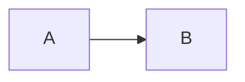
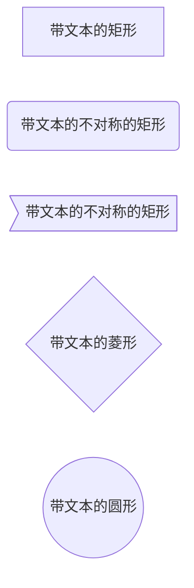
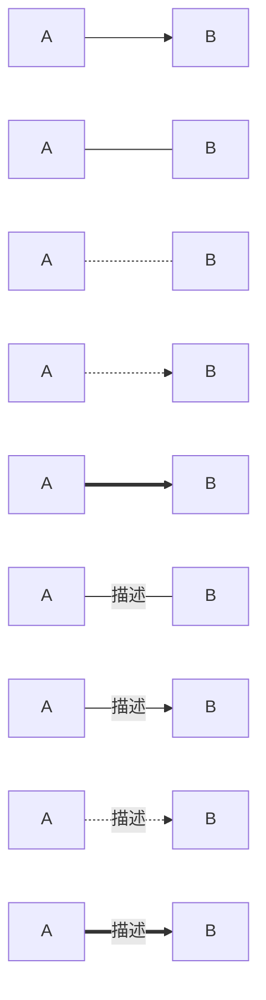
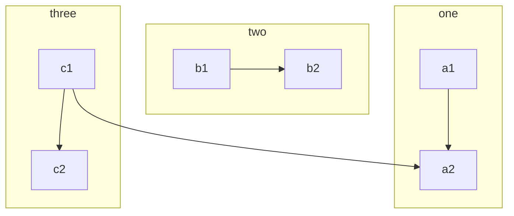
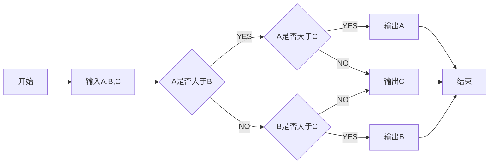

:::tip
在写博客中发现了一个问题，发现很多问题的解决思路都使用都是用文字来表达的，但是文字的缺点就是太抽象，不容易理解，所以就想着用别的方法来改善表达的方式，这时候我想到了流程图，而强大的`Markdown`也可以做流程图。
:::

<!-- more -->

此种方法只针对next主题用户，其他主题没用过，不提供方法。

# 首先需要安装安装插件

```html
npm install hexo-filter-mermaid-diagrams
```
在你的博客目录下，用git执行这条命令。
然后就只需要在`themes/next/_config.yml`主题的配置文件中将
```
mermaid:
  enable: true
```
`mermaid`开启即可

## 在markdown使用mermaid

```
···mermaid
    graph 流程图的方向
    流程图的内容
···
使用的时候，需要将点换成反引号，下面都同理
```
## 流程图的方向

- TB和TD 表示从上到下
- BT和DT 表示从下到上
- RL 表示从右到左
- LR 表示从左到右

**示例**

```
···mermaid
   graph LR
   A --> B
···
```

**效果**



## 流程图的基本图形

**示例**

```
···mermaid
   graph LR
   id[带文本的矩形]
   id4(带文本的不对称的矩形)
   id3>带文本的不对称的矩形]
   id1{带文本的菱形}
   id2((带文本的圆形))
···
```

**效果**



## 节点之间连接线的种类

- A --> B  A带箭头指向B
- A --- B  A不带箭头指向B
- A -.- B  A用虚线指向B
- A -.-> B  A带箭头虚线指向B
- A ==> B  A用加粗的箭头指向B
- A -- 描述 --- B  A不带箭头指向B并在中间加上文字描述
- A -- 描述 --> B  A带箭头指向B并在中间加上文字描述
- A -. 描述 .-> B  A用带箭头的虚线指向B并在中间加上文字描述
- A == 描述 ==> B  A用加粗的箭头指向B并在中间加上文字描述

**示例**

```
···mermaid
   graph LR
   A[A] --> B[B] 
    A1[A] --- B1[B] 
    A4[A] -.- B4[B] 
    A5[A] -.-> B5[B] 
    A7[A] ==> B7[B] 
    A2[A] -- 描述 --- B2[B]
    A3[A] -- 描述 --> B3[B] 
    A6[A] -. 描述 .-> B6[B] 
    A8[A] == 描述 ==> B8[B]
···
```

**效果**



## 子流程图

**使用规范**

```
···subgraph title
     graph 流程图方向
   end
···
```

**示例**

```
···mermaid
   graph TB
    c1-->a2
    subgraph one
    a1-->a2
    end
    subgraph two
    b1-->b2
    end
    subgraph three
    c1-->c2
    end
···
```

**效果**



## 写法实例

绘制一个流程图，找出A、B、C三个数中最大的一个数

**示例**

```
···mermaid
   graph LR
    start[开始] --> input[输入A,B,C]
    input --> conditionA{A是否大于B}
    conditionA -- YES --> conditionC{A是否大于C}
    conditionA -- NO --> conditionB{B是否大于C}
    conditionC -- YES --> printA[输出A]
    conditionC -- NO --> printC[输出C]
    conditionB -- YES --> printB[输出B]
    conditionB -- NO --> printC[输出C]
    printA --> stop[结束]
    printC --> stop
    printB --> stop
···
```

**效果**

