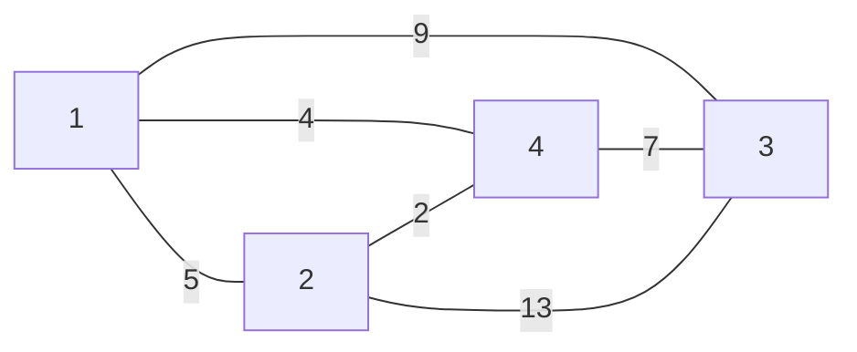
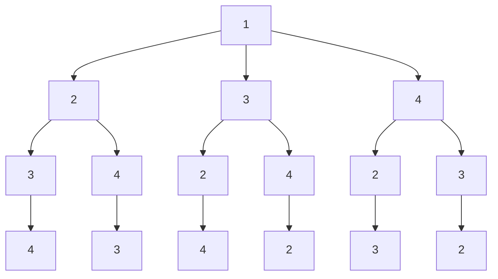

前有八皇后，后有货郎。货郎问题，给定n个城市的集合，从一个城市到另一个城市的距离为正整数，求一条最短且每个城市恰好经过一次的巡回路线。<!--more-->

# 问题引入

某售货员要到若干城市去推销商品，各城市间的距离已知。他要选定一条从驻地出发经过所有的城市最后回到驻地的周游路线，使得总的路程最短。下图就是这几个城市间的距离关系。


# 问题分析

从一个城市出发，每个城市都要走一遍，最后还要回到出发的城市，上面这个图一共有四个城市，那么我该怎么走呢，首先我要选择一个起点吧，我就选从`1`这个点出发，那么下一个点，就要选择`1`的邻接点了，可以看到`2`,`3`,`4`都与`1`直接相连，那么我就在选择去`2`吧，到了`2`之后，又要向下一个城市出发了，与`2`邻接的点有`1`,`3`,`4`，但是`1`我们已经走过了，如果所有的城市都走过了，就可以回到`1`，但是现在`3`,`4`点还没走，所以只能选择`3`,`4`点了，那我就选择走`3`吧，到达`3`之后，就只剩`4`没走了，所以直接从`3`到达`4`，此时所有的点我们都已经走完了，我们要回到出发的那个点,即`1`。`1`-`2`-`3`-`4`-`1`,这个便是其中的一种情况。
其实，我们求得就是这n城市的一个排列，而所有的情况有n!我们要在这么多的情况中，找到一条最短的回路，这条路径也叫做哈密顿回路。
这便是当从`1`开始走的所有情况


# 解决办法

既然哪条回路是最短的我也不知道，那么我把所有的情况都列举一遍，看看哪条路径长度是最短的，那么这条回路就是一条最短的哈密顿回路，抱着这样的思路就开始写吧。

# 实现步骤

## 存储方式

```c++
const int N=110;//假设最大的结点数
int s[N][N];//存储边的长度
int a[N];//保存每次排列的结果
int b[N];//保存最终的排列结果
int Min=1e6+2;//保存最小的权值
```

## 初始化

```c++
void build(int n)
{
    fill(s[0],s[0]+(n+1)*(n+1),0);
    fill(a,a+N,0);
    fill(b,b+N,0);
}
```

## 排列组合未优化版

下面实现排列的思想是这样的，在第一行有n列，选择其中一列放下，再在第二行选择一个位置，但是这个位置不可以和第一行放在同一列，直到n行都排完，则实现了排列一次，然后就按照这个路径求它的权值，直到找到一个最小的权值。
```c++
bool isok(int c)
{
    for(int i=0;i!=c;i++){
        if(a[i]==a[c]){//只要不在同一列就可
            return false;
        }
    }
    return true;
}
void sddr(int row,int n)
{
    if(row>n)   return ;//当行数大于n时结束，不允许越界
    if(row==n){
        int sum=0;//保存当前的权值
        for(int i=0;i<n;i++){
            sum += s[a[i-1]][a[i]]
        }
        sum += s[a[n-1]][a[0]];
        if(sum<Min){//如果当前的权值sum小于最小的权值Min则要进行更新
            Min=sum;
            for(int i=0;i<n;i++){
               b[i]=a[i];
            }
        }
        cout << endl;
        return ;
    }
    else{
        for(int i=0;i<n;i++){
            a[row]=i+1;//第row行放在第几列
            if(isok(row)){//判断row行的第i+1列是否可以放
                sddr(row+1,n);//如果可以放就下一行
            }
        }
    }
}
```
但是这样是没有优化的，必须把每条路径求出来之后，才能知道总的路径长度，下一篇在分析下怎么优化剪枝，具有未来判断性。
