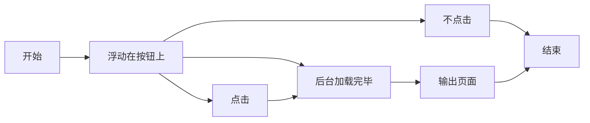

最近又在折腾这个博客，虽然快考试了，但是一直也不知道要复习什么，无聊就瞎折腾吧。博客的源文件中的文件中有大量的空白，虽然是一些空格，但是也会占据空间，影响加载速度，本次目的就是为了提高加载速度。<!--more-->

# 为什么我要去掉评论

第一个方面就是要提高加载速度，因为评论功能使用的是第三方的，当页面加载的时候，评论功能也是要加载的，在`tools.pingdom.com`中测试网站速度的时候，发现评论占据了大量的时间。第二个方面就是，博客中基本上就是我自己看，也很少有其他的人看，所以评论在那里就非常的尴尬，去掉影响也不是很大。

# gulp压缩

`gulp`是基于流的自动化构建工具，里面包含了众多的插件，使用哪个只要安装就可以使用，最后只要要创建一定的规则就可以使用这些插件。

## 首先我们要先安装的就是gulp

执行`npm install gulp`

## 然后依次执行以下命令

```html
npm install gulp-htmlclean//在不改变html结构下缩小
npm install gulp-htmlmin//压缩html
npm install gulp-clean-css//压缩css
npm install gulp-uglify//压缩js
npm install gulp-imagemin//压缩图片
```

网上很多用gulp压缩css插件都用的是`gulp-minify-css`,这在`gulp4.0`已经被放弃，所以上使用上面的css压缩插件

## 然后再在博客根目录中创建gulpfile.js文件

这是文件中的内容

```html
var gulp = require('gulp');
var cleancss = require('gulp-clean-css');
var uglify = require('gulp-uglify');
var htmlmin = require('gulp-htmlmin');
var htmlclean = require('gulp-htmlclean');
var imagemin = require('gulp-imagemin');

// 压缩 public 目录 html文件
gulp.task('minify-html', function() {
    return gulp.src('./public/**/*.html')
        .pipe(htmlclean())
        .pipe(htmlmin({
            removeComments: true,
            minifyJS: true,
            minifyCSS: true,
            minifyURLs: true,
        }))
        .pipe(gulp.dest('./public'))
});
// 压缩 public 目录 css文件
gulp.task('minify-css', function() {
    return gulp.src('./public/**/*.css')
        .pipe(cleancss({
            compatibility: 'ie8'
        }))
        .pipe(gulp.dest('./public'));
});
// 压缩 public/js 目录 js文件
gulp.task('minify-js', function() {
    return gulp.src('./public/js/**/*.js')
        .pipe(uglify())
        .pipe(gulp.dest('./public/js'));
});
// 压缩图片
gulp.task('minify-images', function() {
    return gulp.src('./public/images/**/*.*')
        .pipe(imagemin(
        [imagemin.gifsicle({'optimizationLevel': 3}),
        imagemin.jpegtran({'progressive': true}),
        imagemin.optipng({'optimizationLevel': 7}),
        imagemin.svgo()],
        {'verbose': true}))
        .pipe(gulp.dest('./public/images'))
});
// 默认任务
gulp.task('default', gulp.parallel(
    'minify-html','minify-css','minify-js','minify-images'
));
```

## 使用方法

顺序不能错了

```html
hexo clean
hexo g
gulp
```

# InstantClick是什么

`InstantClick`在网上都被别人叫做神器，可以假装网站运行的速度很快，当你的鼠标移动到你要点的那个按钮，后台就会自动开启预浏览模式，也就是当鼠标浮动在按钮之上时，你要点击的事件在后台就已经开始运行了(也许都已经运行完成了)，当你再点击的时候速度当然会提升很多。
具体原理是这样，但是我在使用的时候也没真真切切感觉速度有多么质的飞跃，没啥感觉。
再练习一下流程图吧。




# InstantClick实现方法

## 首先需要下载创建instantclick.min.js文件

[instantclick.min.js](http://instantclick.io/v3.1.0/instantclick.min.js),直接点击就可以跳转到文件页面，直接点击右键另存为就可以了，或者创建`instantclick.min.js`文件，把链接中的内容复制下来放到里面也可以。
把新创建的文件放在`themes/next/source/js/src`中。

## 如何使用InstantClick

路径`themes/layout/_layout.swig`，打开`_layout.swig`在最下面的`body`(这里怕乱码就不用标签写了)上面，添加以下代码

```html
    <script src="/js/src/instantclick.min.js" data-no-instant></script>
    <script data-no-instant>InstantClick.init(true);</script>//里面是true就是默认所有都不预加载
    </body>//不包括
    </html>//不包括，只为了好找
```

这时候，我们就已经完成了，部署到github上，看看效果吧。
hexo博客似乎不支持，我原先以为成功了，原来一直都没有，true原来是所有都不预加载。
备方案：
直接在原位置引用这段就可以了
```html
<script src="//instant.page/1.2.2" type="module" integrity="sha384-2xV8M5griQmzyiY3CDqh1dn4z3llDVqZDqzjzcY+jCBCk/a5fXJmuZ/40JJAPeoU"></script>
```