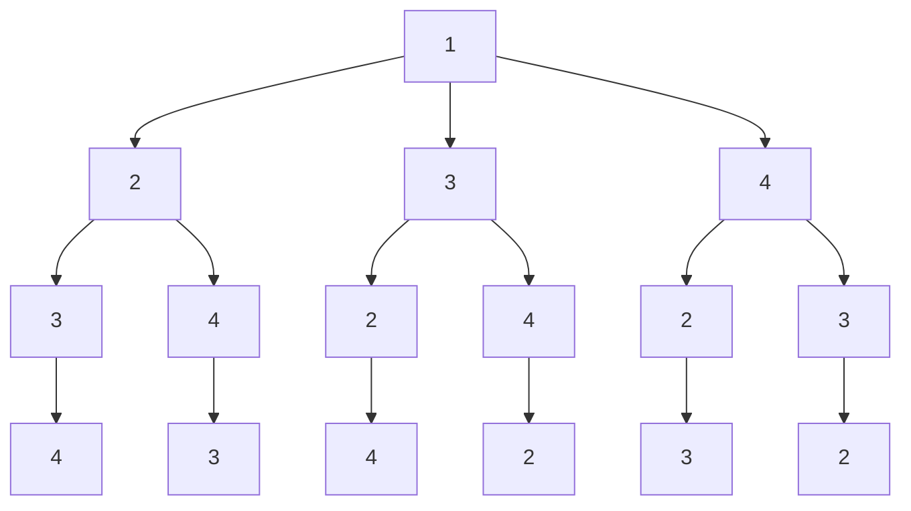

前有八皇后，后有货郎。货郎问题，给定n个城市的集合，从一个城市到另一个城市的距离为正整数，求一条最短且每个城市恰好经过一次的巡回路线。<!--more-->

# 问题引入

某售货员要到若干城市去推销商品，各城市间的距离已知。他要选定一条从驻地出发经过所有的城市最后回到驻地的周游路线，使得总的路程最短。下图就是这几个城市间的距离关系。

![draw](data:image/svg+xml;base64,PD94bWwgdmVyc2lvbj0iMS4wIiBlbmNvZGluZz0iVVRGLTgiPz4KPCFET0NUWVBFIHN2ZyBQVUJMSUMgIi0vL1czQy8vRFREIFNWRyAxLjEvL0VOIiAiaHR0cDovL3d3dy53My5vcmcvR3JhcGhpY3MvU1ZHLzEuMS9EVEQvc3ZnMTEuZHRkIj4KPHN2ZyB4bWxucz0iaHR0cDovL3d3dy53My5vcmcvMjAwMC9zdmciIHhtbG5zOnhsaW5rPSJodHRwOi8vd3d3LnczLm9yZy8xOTk5L3hsaW5rIiB2ZXJzaW9uPSIxLjEiIHdpZHRoPSI0OTVweCIgaGVpZ2h0PSI1NzJweCIgdmlld0JveD0iLTAuNSAtMC41IDQ5NSA1NzIiIGNvbnRlbnQ9IiZsdDtteGZpbGUgaG9zdD0mcXVvdDt3d3cuZHJhdy5pbyZxdW90OyBtb2RpZmllZD0mcXVvdDsyMDIwLTAxLTEyVDE0OjU5OjEyLjc3OVomcXVvdDsgYWdlbnQ9JnF1b3Q7TW96aWxsYS81LjAgKFdpbmRvd3MgTlQgMTAuMDsgV2luNjQ7IHg2NCkgQXBwbGVXZWJLaXQvNTM3LjM2IChLSFRNTCwgbGlrZSBHZWNrbykgQ2hyb21lLzc5LjAuMzk0NS4xMTcgU2FmYXJpLzUzNy4zNiZxdW90OyBldGFnPSZxdW90Ozd2UllFUlE5bGNkanpzZ2R4NFo2JnF1b3Q7IHZlcnNpb249JnF1b3Q7MTIuNS4xJnF1b3Q7Jmd0OyZsdDtkaWFncmFtIGlkPSZxdW90O3RYWUk0WlYyMXZwdFRnMVJwVVRBJnF1b3Q7IG5hbWU9JnF1b3Q756ysIDEg6aG1JnF1b3Q7Jmd0OzdWdGJjOW80RlA0MVBLWmpTMGpneDRSbXUrM3N6dXhNWm5yWk53VUxvNjJ3dkVJRTZLK3ZqQ1Y4QTJJVEU1bTBlY0huNks3em5jOUhSODRBVGhhYkQ1SWs4NzlGU1BrQWVPRm1BTjhQQVBBaEF2b24xV3d6elFnYVJTUlphQ3JsaWdmMmd4cWxaN1FyRnRKbHFhSVNnaXVXbEpWVEVjZDBxa282SXFWWWw2dk5CQytQbXBDSTFoUVBVOExyMmk4c1ZQTk1Pd2FqWFA4blpkSGNqdXpqSUN0WkVGdlpyR1E1SjZGWUYxVHdmZ0FuVWdpVlBTMDJFOHJUemJQN2tyWDc0MGpwZm1LU3hxcEpneVc1QzlqczhmSERSM1h6NzVmSnAyajErZU1OQ3JDWm5kcmFKZE5RNzRBUmhWUnpFWW1ZOFB0Y2U2ZVhrcVNsbk1YZnRUaGR5U2VhanVKclFZcFZITzRrVDB0NSs3K0VTRXlWLzZoU1cyTnFzbEpDcStacXdVMHAzVEQxTlczK0RobnBtK2tzZlg2L0tRcGJLOFJLYmd1TlV2R2I3UzhWOG1ZN3liYkwxcDR1K09pbUd0VlNyT1NVbnRoSjdJOE5QSW1NcURxMTU2UGMvTnB2cUZoUVBTZmRVbEpPRkhzcXo0VVlBRWY3ZXJtTjlZTXhjeHVUVzRRK0ViNHlZdzBBNW5yS2R6T2hsMTBFQS81L0pXekJ6WEpuc2x0ZFlUaE9Obm1oZm9yU1g5OTJvK2VWOVpUcDZ3ampYUHR2aXFUMW5DbjZrSkRkMXE0MWhaU3hRSlpKNXRRenRra3haYnA2b2xMUnpXbVQxYmZYTklDQmNjaHRSVjRYL051bzVnWFh0cnJ1RFJJRWZmVkJ2K2lCZTM5OHhnZjlvZ2NXSFBJMWZEQm83SU5IUU5MWUIzZE5iNlVrMjBLRlJMQllMUXM5LzVNcWN1emhVUmw3d0t0dzlqUDFjZUJWNEpiTklBZmZmaW5uNHhGN1hsL3g2SjJEUjg4aEhrZU44UWhjNE5FZnQ4Tmp0ZjdyNEJIQ3Z1THhMSDUwaDBkazZlUlpQQm9tZFJhajJJbDJIcU9BcTR4UmZPdzRSc0dlWDkraGZ2amdXZThFbHpHS1BjWmUvcDN3TXBPRDN0THVsUjBOVGJEWmlIYVJXOXIxTDBTNzhDcG9GK0ZLZUlOYzB5NzRuWjdweWdkQll4L0VibjBRWE1nSGgxZmhnL3ZNYjI5ODBPK2VGTDJwNEVLV1dnd0FuTTB3aFY3ZGNLT21odE83cnNvV1dpb3B2dE9KR1MwV2NXclZHZU84b2lLY1JiRVdwOXBLVk92dlVodXlLZUczcG1EQndwQWZnMFNaVkRvQXdiQUtnaEdxZ1dCNEFBVHdja1Q4dG5JaTd1TGZOc0ZRSnptNldoSURvZUFkTHZ5TnlsQWJIeXkxM1dmck16MmV5SlNBYWpmRE5xTmtlMU1icGJPTWlvOGNVMXJ3eTFFYXFxVE9rRjkvcjcweXBmWDJTSDllV3EwY1czcXZTR200NmJYRHk4OTNoOWxtaUUreXpSQWNMbTVMYWlnNHlaeER0NXlHSFhOYTQvajZ6WERhbnB6NncybW9yNXgyM3RYVlZYRGFTOC9MaDhrR25vNmd1dUkwVUdXdFNxRG1sdFJnYjQ4ZFYzYjExZVlxMXVubk9mdUpPbnVQTmI0aWV6dnZNVkM1Ymh1N1RqZllqOG1jZ1FEOWNpQ281cHlnNXpxWWdiMDlvRjFiOHI5Rk1ETytTREJ6TEZxeFdEc1M2N1FOWnA0WkJzRFR3MXo4aU5iOWw2ZnRXTTF2ZkEvNVptZ05WVDhsdWR5N1RZdjU1K3daYVBKL0NvRDNQd0U9Jmx0Oy9kaWFncmFtJmd0OyZsdDsvbXhmaWxlJmd0OyIgc3R5bGU9ImJhY2tncm91bmQtY29sb3I6IHJnYigyNTUsIDI1NSwgMjU1KTsiPjxkZWZzLz48Zz48cGF0aCBkPSJNIDI0OS42NyAxMzkuNjcgTCAyNDkuNjcgNzkuNjcgTSAyNTMuNjcgNzkuNjcgTCAyNTMuNjcgMTM5LjY3IE0gMjUzLjY3IDc5LjY3IiBmaWxsPSJub25lIiBzdHJva2U9IiMwMDAwMDAiIHN0cm9rZS1taXRlcmxpbWl0PSIxMCIgcG9pbnRlci1ldmVudHM9ImFsbCIvPjxlbGxpcHNlIGN4PSIyNTIiIGN5PSIyNzAiIHJ4PSI0MCIgcnk9IjQwIiBmaWxsPSIjZmZmZmZmIiBzdHJva2U9IiMwMDAwMDAiIHBvaW50ZXItZXZlbnRzPSJhbGwiLz48ZyB0cmFuc2Zvcm09InRyYW5zbGF0ZSgtMC41IC0wLjUpIj48c3dpdGNoPjxmb3JlaWduT2JqZWN0IHN0eWxlPSJvdmVyZmxvdzogdmlzaWJsZTsgdGV4dC1hbGlnbjogbGVmdDsiIHBvaW50ZXItZXZlbnRzPSJub25lIiB3aWR0aD0iMTAwJSIgaGVpZ2h0PSIxMDAlIiByZXF1aXJlZEZlYXR1cmVzPSJodHRwOi8vd3d3LnczLm9yZy9UUi9TVkcxMS9mZWF0dXJlI0V4dGVuc2liaWxpdHkiPjxkaXYgeG1sbnM9Imh0dHA6Ly93d3cudzMub3JnLzE5OTkveGh0bWwiIHN0eWxlPSJkaXNwbGF5OiBmbGV4OyBhbGlnbi1pdGVtczogdW5zYWZlIGNlbnRlcjsganVzdGlmeS1jb250ZW50OiB1bnNhZmUgY2VudGVyOyB3aWR0aDogNzZweDsgaGVpZ2h0OiAxcHg7IHBhZGRpbmctdG9wOiAyNzBweDsgbWFyZ2luLWxlZnQ6IDIxNHB4OyI+PGRpdiBzdHlsZT0iYm94LXNpemluZzogYm9yZGVyLWJveDsgdGV4dC1hbGlnbjogY2VudGVyOyAiPjxkaXYgc3R5bGU9ImRpc3BsYXk6IGlubGluZS1ibG9jazsgZm9udC1zaXplOiAxMnB4OyBmb250LWZhbWlseTogSGVsdmV0aWNhOyBjb2xvcjogIzAwMDAwMDsgbGluZS1oZWlnaHQ6IDEuMjsgcG9pbnRlci1ldmVudHM6IGFsbDsgd2hpdGUtc3BhY2U6IG5vcm1hbDsgd29yZC13cmFwOiBub3JtYWw7ICI+PGZvbnQgc3R5bGU9ImZvbnQtc2l6ZTogNDhweCI+MTwvZm9udD48L2Rpdj48L2Rpdj48L2Rpdj48L2ZvcmVpZ25PYmplY3Q+PHRleHQgeD0iMjUyIiB5PSIyNzQiIGZpbGw9IiMwMDAwMDAiIGZvbnQtZmFtaWx5PSJIZWx2ZXRpY2EiIGZvbnQtc2l6ZT0iMTJweCIgdGV4dC1hbmNob3I9Im1pZGRsZSI+MTwvdGV4dD48L3N3aXRjaD48L2c+PHBhdGggZD0iTSA0NTEuNjcgMzcuNjcgTCA0OTMuNjcgMzcuNjcgTCA0OTMuNjcgNTMxLjY3IEwgNDYxLjY3IDUzMS42NyBNIDQ2MS42NyA1MjcuNjcgTCA0ODkuNjcgNTI3LjY3IEwgNDg5LjY3IDQxLjY3IEwgNDUxLjY3IDQxLjY3IE0gNDYxLjY3IDUyNy42NyIgZmlsbD0ibm9uZSIgc3Ryb2tlPSIjMDAwMDAwIiBzdHJva2UtbWl0ZXJsaW1pdD0iMS40MiIgcG9pbnRlci1ldmVudHM9ImFsbCIvPjxwYXRoIGQ9Ik0gNDEuNjcgNDEuNjcgTCAzLjY3IDQxLjY3IEwgMy42NyA1MjcuNjcgTCAzMS42NyA1MjcuNjcgTSAzMS42NyA1MzEuNjcgTCAtMC4zMyA1MzEuNjcgTCAtMC4zMyAzNy42NyBMIDQxLjY3IDM3LjY3IE0gMzEuNjcgNTMxLjY3IiBmaWxsPSJub25lIiBzdHJva2U9IiMwMDAwMDAiIHN0cm9rZS1taXRlcmxpbWl0PSIxLjQyIiBwb2ludGVyLWV2ZW50cz0iYWxsIi8+PHBhdGggZD0iTSAyOTEuNjcgMzcuNjcgTCA0MTEuNjcgMzcuNjcgTSA0MTEuNjcgNDEuNjcgTCAyOTEuNjcgNDEuNjcgTSA0MTEuNjcgNDEuNjciIGZpbGw9Im5vbmUiIHN0cm9rZT0iIzAwMDAwMCIgc3Ryb2tlLW1pdGVybGltaXQ9IjEwIiBwb2ludGVyLWV2ZW50cz0iYWxsIi8+PGVsbGlwc2UgY3g9IjI1MiIgY3k9IjQwIiByeD0iNDAiIHJ5PSI0MCIgZmlsbD0iI2ZmZmZmZiIgc3Ryb2tlPSIjMDAwMDAwIiBwb2ludGVyLWV2ZW50cz0iYWxsIi8+PGcgdHJhbnNmb3JtPSJ0cmFuc2xhdGUoLTAuNSAtMC41KSI+PHN3aXRjaD48Zm9yZWlnbk9iamVjdCBzdHlsZT0ib3ZlcmZsb3c6IHZpc2libGU7IHRleHQtYWxpZ246IGxlZnQ7IiBwb2ludGVyLWV2ZW50cz0ibm9uZSIgd2lkdGg9IjEwMCUiIGhlaWdodD0iMTAwJSIgcmVxdWlyZWRGZWF0dXJlcz0iaHR0cDovL3d3dy53My5vcmcvVFIvU1ZHMTEvZmVhdHVyZSNFeHRlbnNpYmlsaXR5Ij48ZGl2IHhtbG5zPSJodHRwOi8vd3d3LnczLm9yZy8xOTk5L3hodG1sIiBzdHlsZT0iZGlzcGxheTogZmxleDsgYWxpZ24taXRlbXM6IHVuc2FmZSBjZW50ZXI7IGp1c3RpZnktY29udGVudDogdW5zYWZlIGNlbnRlcjsgd2lkdGg6IDc2cHg7IGhlaWdodDogMXB4OyBwYWRkaW5nLXRvcDogNDBweDsgbWFyZ2luLWxlZnQ6IDIxNHB4OyI+PGRpdiBzdHlsZT0iYm94LXNpemluZzogYm9yZGVyLWJveDsgdGV4dC1hbGlnbjogY2VudGVyOyAiPjxkaXYgc3R5bGU9ImRpc3BsYXk6IGlubGluZS1ibG9jazsgZm9udC1zaXplOiAxMnB4OyBmb250LWZhbWlseTogSGVsdmV0aWNhOyBjb2xvcjogIzAwMDAwMDsgbGluZS1oZWlnaHQ6IDEuMjsgcG9pbnRlci1ldmVudHM6IGFsbDsgd2hpdGUtc3BhY2U6IG5vcm1hbDsgd29yZC13cmFwOiBub3JtYWw7ICI+PGZvbnQgc3R5bGU9ImZvbnQtc2l6ZTogNDhweCI+MjwvZm9udD48L2Rpdj48L2Rpdj48L2Rpdj48L2ZvcmVpZ25PYmplY3Q+PHRleHQgeD0iMjUyIiB5PSI0NCIgZmlsbD0iIzAwMDAwMCIgZm9udC1mYW1pbHk9IkhlbHZldGljYSIgZm9udC1zaXplPSIxMnB4IiB0ZXh0LWFuY2hvcj0ibWlkZGxlIj4yPC90ZXh0Pjwvc3dpdGNoPjwvZz48cGF0aCBkPSJNIDIzMS42NyA1MzEuNjcgTCAxMTEuNjcgNTMxLjY3IE0gMTExLjY3IDUyNy42NyBMIDIzMS42NyA1MjcuNjcgTSAxMTEuNjcgNTI3LjY3IiBmaWxsPSJub25lIiBzdHJva2U9IiMwMDAwMDAiIHN0cm9rZS1taXRlcmxpbWl0PSIxMCIgcG9pbnRlci1ldmVudHM9ImFsbCIvPjxwYXRoIGQ9Ik0gNDE5LjY3IDQ4OS42NyBMIDQxOS42NyAzNzkuNjcgTSA0MjMuNjcgMzc5LjY3IEwgNDIzLjY3IDQ4OS42NyBNIDQyMy42NyAzNzkuNjciIGZpbGw9Im5vbmUiIHN0cm9rZT0iIzAwMDAwMCIgc3Ryb2tlLW1pdGVybGltaXQ9IjEwIiBwb2ludGVyLWV2ZW50cz0iYWxsIi8+PGVsbGlwc2UgY3g9IjQyMiIgY3k9IjUzMCIgcng9IjQwIiByeT0iNDAiIGZpbGw9IiNmZmZmZmYiIHN0cm9rZT0iIzAwMDAwMCIgcG9pbnRlci1ldmVudHM9ImFsbCIvPjxnIHRyYW5zZm9ybT0idHJhbnNsYXRlKC0wLjUgLTAuNSkiPjxzd2l0Y2g+PGZvcmVpZ25PYmplY3Qgc3R5bGU9Im92ZXJmbG93OiB2aXNpYmxlOyB0ZXh0LWFsaWduOiBsZWZ0OyIgcG9pbnRlci1ldmVudHM9Im5vbmUiIHdpZHRoPSIxMDAlIiBoZWlnaHQ9IjEwMCUiIHJlcXVpcmVkRmVhdHVyZXM9Imh0dHA6Ly93d3cudzMub3JnL1RSL1NWRzExL2ZlYXR1cmUjRXh0ZW5zaWJpbGl0eSI+PGRpdiB4bWxucz0iaHR0cDovL3d3dy53My5vcmcvMTk5OS94aHRtbCIgc3R5bGU9ImRpc3BsYXk6IGZsZXg7IGFsaWduLWl0ZW1zOiB1bnNhZmUgY2VudGVyOyBqdXN0aWZ5LWNvbnRlbnQ6IHVuc2FmZSBjZW50ZXI7IHdpZHRoOiA3NnB4OyBoZWlnaHQ6IDFweDsgcGFkZGluZy10b3A6IDUzMHB4OyBtYXJnaW4tbGVmdDogMzg0cHg7Ij48ZGl2IHN0eWxlPSJib3gtc2l6aW5nOiBib3JkZXItYm94OyB0ZXh0LWFsaWduOiBjZW50ZXI7ICI+PGRpdiBzdHlsZT0iZGlzcGxheTogaW5saW5lLWJsb2NrOyBmb250LXNpemU6IDEycHg7IGZvbnQtZmFtaWx5OiBIZWx2ZXRpY2E7IGNvbG9yOiAjMDAwMDAwOyBsaW5lLWhlaWdodDogMS4yOyBwb2ludGVyLWV2ZW50czogYWxsOyB3aGl0ZS1zcGFjZTogbm9ybWFsOyB3b3JkLXdyYXA6IG5vcm1hbDsgIj48Zm9udCBzdHlsZT0iZm9udC1zaXplOiA0OHB4Ij4zPC9mb250PjwvZGl2PjwvZGl2PjwvZGl2PjwvZm9yZWlnbk9iamVjdD48dGV4dCB4PSI0MjIiIHk9IjUzNCIgZmlsbD0iIzAwMDAwMCIgZm9udC1mYW1pbHk9IkhlbHZldGljYSIgZm9udC1zaXplPSIxMnB4IiB0ZXh0LWFuY2hvcj0ibWlkZGxlIj4zPC90ZXh0Pjwvc3dpdGNoPjwvZz48cGF0aCBkPSJNIDY5LjY3IDQ4OS42NyBMIDY5LjY3IDM3OS42NyBNIDczLjY3IDM3OS42NyBMIDczLjY3IDQ4OS42NyBNIDczLjY3IDM3OS42NyIgZmlsbD0ibm9uZSIgc3Ryb2tlPSIjMDAwMDAwIiBzdHJva2UtbWl0ZXJsaW1pdD0iMTAiIHBvaW50ZXItZXZlbnRzPSJhbGwiLz48ZWxsaXBzZSBjeD0iNzIiIGN5PSI1MzAiIHJ4PSI0MCIgcnk9IjQwIiBmaWxsPSIjZmZmZmZmIiBzdHJva2U9IiMwMDAwMDAiIHBvaW50ZXItZXZlbnRzPSJhbGwiLz48ZyB0cmFuc2Zvcm09InRyYW5zbGF0ZSgtMC41IC0wLjUpIj48c3dpdGNoPjxmb3JlaWduT2JqZWN0IHN0eWxlPSJvdmVyZmxvdzogdmlzaWJsZTsgdGV4dC1hbGlnbjogbGVmdDsiIHBvaW50ZXItZXZlbnRzPSJub25lIiB3aWR0aD0iMTAwJSIgaGVpZ2h0PSIxMDAlIiByZXF1aXJlZEZlYXR1cmVzPSJodHRwOi8vd3d3LnczLm9yZy9UUi9TVkcxMS9mZWF0dXJlI0V4dGVuc2liaWxpdHkiPjxkaXYgeG1sbnM9Imh0dHA6Ly93d3cudzMub3JnLzE5OTkveGh0bWwiIHN0eWxlPSJkaXNwbGF5OiBmbGV4OyBhbGlnbi1pdGVtczogdW5zYWZlIGNlbnRlcjsganVzdGlmeS1jb250ZW50OiB1bnNhZmUgY2VudGVyOyB3aWR0aDogNzZweDsgaGVpZ2h0OiAxcHg7IHBhZGRpbmctdG9wOiA1MzBweDsgbWFyZ2luLWxlZnQ6IDM0cHg7Ij48ZGl2IHN0eWxlPSJib3gtc2l6aW5nOiBib3JkZXItYm94OyB0ZXh0LWFsaWduOiBjZW50ZXI7ICI+PGRpdiBzdHlsZT0iZGlzcGxheTogaW5saW5lLWJsb2NrOyBmb250LXNpemU6IDEycHg7IGZvbnQtZmFtaWx5OiBIZWx2ZXRpY2E7IGNvbG9yOiAjMDAwMDAwOyBsaW5lLWhlaWdodDogMS4yOyBwb2ludGVyLWV2ZW50czogYWxsOyB3aGl0ZS1zcGFjZTogbm9ybWFsOyB3b3JkLXdyYXA6IG5vcm1hbDsgIj48Zm9udCBzdHlsZT0iZm9udC1zaXplOiA0OHB4Ij40PC9mb250PjwvZGl2PjwvZGl2PjwvZGl2PjwvZm9yZWlnbk9iamVjdD48dGV4dCB4PSI3MiIgeT0iNTM0IiBmaWxsPSIjMDAwMDAwIiBmb250LWZhbWlseT0iSGVsdmV0aWNhIiBmb250LXNpemU9IjEycHgiIHRleHQtYW5jaG9yPSJtaWRkbGUiPjQ8L3RleHQ+PC9zd2l0Y2g+PC9nPjxyZWN0IHg9IjIzMiIgeT0iNTE1IiB3aWR0aD0iNDAiIGhlaWdodD0iMzAiIGZpbGw9Im5vbmUiIHN0cm9rZT0ibm9uZSIgcG9pbnRlci1ldmVudHM9ImFsbCIvPjxnIHRyYW5zZm9ybT0idHJhbnNsYXRlKC0wLjUgLTAuNSkiPjxzd2l0Y2g+PGZvcmVpZ25PYmplY3Qgc3R5bGU9Im92ZXJmbG93OiB2aXNpYmxlOyB0ZXh0LWFsaWduOiBsZWZ0OyIgcG9pbnRlci1ldmVudHM9Im5vbmUiIHdpZHRoPSIxMDAlIiBoZWlnaHQ9IjEwMCUiIHJlcXVpcmVkRmVhdHVyZXM9Imh0dHA6Ly93d3cudzMub3JnL1RSL1NWRzExL2ZlYXR1cmUjRXh0ZW5zaWJpbGl0eSI+PGRpdiB4bWxucz0iaHR0cDovL3d3dy53My5vcmcvMTk5OS94aHRtbCIgc3R5bGU9ImRpc3BsYXk6IGZsZXg7IGFsaWduLWl0ZW1zOiB1bnNhZmUgY2VudGVyOyBqdXN0aWZ5LWNvbnRlbnQ6IHVuc2FmZSBjZW50ZXI7IHdpZHRoOiAzNnB4OyBoZWlnaHQ6IDFweDsgcGFkZGluZy10b3A6IDUzMHB4OyBtYXJnaW4tbGVmdDogMjM0cHg7Ij48ZGl2IHN0eWxlPSJib3gtc2l6aW5nOiBib3JkZXItYm94OyB0ZXh0LWFsaWduOiBjZW50ZXI7ICI+PGRpdiBzdHlsZT0iZGlzcGxheTogaW5saW5lLWJsb2NrOyBmb250LXNpemU6IDEycHg7IGZvbnQtZmFtaWx5OiBIZWx2ZXRpY2E7IGNvbG9yOiAjMDAwMDAwOyBsaW5lLWhlaWdodDogMS4yOyBwb2ludGVyLWV2ZW50czogYWxsOyB3aGl0ZS1zcGFjZTogbm9ybWFsOyB3b3JkLXdyYXA6IG5vcm1hbDsgIj48Zm9udCBzdHlsZT0iZm9udC1zaXplOiA0OHB4IiBjb2xvcj0iI2ZmNmUzMCI+NzwvZm9udD48L2Rpdj48L2Rpdj48L2Rpdj48L2ZvcmVpZ25PYmplY3Q+PHRleHQgeD0iMjUyIiB5PSI1MzQiIGZpbGw9IiMwMDAwMDAiIGZvbnQtZmFtaWx5PSJIZWx2ZXRpY2EiIGZvbnQtc2l6ZT0iMTJweCIgdGV4dC1hbmNob3I9Im1pZGRsZSI+NzwvdGV4dD48L3N3aXRjaD48L2c+PHBhdGggZD0iTSAzODEuNjcgNTMxLjY3IEwgMjcxLjY3IDUzMS42NyBNIDI3MS42NyA1MjcuNjcgTCAzODEuNjcgNTI3LjY3IE0gMjcxLjY3IDUyNy42NyIgZmlsbD0ibm9uZSIgc3Ryb2tlPSIjMDAwMDAwIiBzdHJva2UtbWl0ZXJsaW1pdD0iMTAiIHBvaW50ZXItZXZlbnRzPSJhbGwiLz48cmVjdCB4PSI0MDIiIHk9IjM1MCIgd2lkdGg9IjQwIiBoZWlnaHQ9IjMwIiBmaWxsPSJub25lIiBzdHJva2U9Im5vbmUiIHBvaW50ZXItZXZlbnRzPSJhbGwiLz48ZyB0cmFuc2Zvcm09InRyYW5zbGF0ZSgtMC41IC0wLjUpIj48c3dpdGNoPjxmb3JlaWduT2JqZWN0IHN0eWxlPSJvdmVyZmxvdzogdmlzaWJsZTsgdGV4dC1hbGlnbjogbGVmdDsiIHBvaW50ZXItZXZlbnRzPSJub25lIiB3aWR0aD0iMTAwJSIgaGVpZ2h0PSIxMDAlIiByZXF1aXJlZEZlYXR1cmVzPSJodHRwOi8vd3d3LnczLm9yZy9UUi9TVkcxMS9mZWF0dXJlI0V4dGVuc2liaWxpdHkiPjxkaXYgeG1sbnM9Imh0dHA6Ly93d3cudzMub3JnLzE5OTkveGh0bWwiIHN0eWxlPSJkaXNwbGF5OiBmbGV4OyBhbGlnbi1pdGVtczogdW5zYWZlIGNlbnRlcjsganVzdGlmeS1jb250ZW50OiB1bnNhZmUgY2VudGVyOyB3aWR0aDogMzZweDsgaGVpZ2h0OiAxcHg7IHBhZGRpbmctdG9wOiAzNjVweDsgbWFyZ2luLWxlZnQ6IDQwNHB4OyI+PGRpdiBzdHlsZT0iYm94LXNpemluZzogYm9yZGVyLWJveDsgdGV4dC1hbGlnbjogY2VudGVyOyAiPjxkaXYgc3R5bGU9ImRpc3BsYXk6IGlubGluZS1ibG9jazsgZm9udC1zaXplOiAxMnB4OyBmb250LWZhbWlseTogSGVsdmV0aWNhOyBjb2xvcjogIzAwMDAwMDsgbGluZS1oZWlnaHQ6IDEuMjsgcG9pbnRlci1ldmVudHM6IGFsbDsgd2hpdGUtc3BhY2U6IG5vcm1hbDsgd29yZC13cmFwOiBub3JtYWw7ICI+PGZvbnQgc3R5bGU9ImZvbnQtc2l6ZTogNDhweCIgY29sb3I9IiNmZjZlMzAiPjk8L2ZvbnQ+PC9kaXY+PC9kaXY+PC9kaXY+PC9mb3JlaWduT2JqZWN0Pjx0ZXh0IHg9IjQyMiIgeT0iMzY5IiBmaWxsPSIjMDAwMDAwIiBmb250LWZhbWlseT0iSGVsdmV0aWNhIiBmb250LXNpemU9IjEycHgiIHRleHQtYW5jaG9yPSJtaWRkbGUiPjk8L3RleHQ+PC9zd2l0Y2g+PC9nPjxwYXRoIGQ9Ik0gMjkxLjY3IDI2Ny42NyBMIDQyMy42NyAyNjcuNjcgTCA0MjMuNjcgMzQ5LjY3IE0gNDE5LjY3IDM0OS42NyBMIDQxOS42NyAyNzEuNjcgTCAyOTEuNjcgMjcxLjY3IE0gNDE5LjY3IDM0OS42NyIgZmlsbD0ibm9uZSIgc3Ryb2tlPSIjMDAwMDAwIiBzdHJva2UtbWl0ZXJsaW1pdD0iMS40MiIgcG9pbnRlci1ldmVudHM9ImFsbCIvPjxyZWN0IHg9IjUyIiB5PSIzNTAiIHdpZHRoPSI0MCIgaGVpZ2h0PSIzMCIgZmlsbD0ibm9uZSIgc3Ryb2tlPSJub25lIiBwb2ludGVyLWV2ZW50cz0iYWxsIi8+PGcgdHJhbnNmb3JtPSJ0cmFuc2xhdGUoLTAuNSAtMC41KSI+PHN3aXRjaD48Zm9yZWlnbk9iamVjdCBzdHlsZT0ib3ZlcmZsb3c6IHZpc2libGU7IHRleHQtYWxpZ246IGxlZnQ7IiBwb2ludGVyLWV2ZW50cz0ibm9uZSIgd2lkdGg9IjEwMCUiIGhlaWdodD0iMTAwJSIgcmVxdWlyZWRGZWF0dXJlcz0iaHR0cDovL3d3dy53My5vcmcvVFIvU1ZHMTEvZmVhdHVyZSNFeHRlbnNpYmlsaXR5Ij48ZGl2IHhtbG5zPSJodHRwOi8vd3d3LnczLm9yZy8xOTk5L3hodG1sIiBzdHlsZT0iZGlzcGxheTogZmxleDsgYWxpZ24taXRlbXM6IHVuc2FmZSBjZW50ZXI7IGp1c3RpZnktY29udGVudDogdW5zYWZlIGNlbnRlcjsgd2lkdGg6IDM2cHg7IGhlaWdodDogMXB4OyBwYWRkaW5nLXRvcDogMzY1cHg7IG1hcmdpbi1sZWZ0OiA1NHB4OyI+PGRpdiBzdHlsZT0iYm94LXNpemluZzogYm9yZGVyLWJveDsgdGV4dC1hbGlnbjogY2VudGVyOyAiPjxkaXYgc3R5bGU9ImRpc3BsYXk6IGlubGluZS1ibG9jazsgZm9udC1zaXplOiAxMnB4OyBmb250LWZhbWlseTogSGVsdmV0aWNhOyBjb2xvcjogIzAwMDAwMDsgbGluZS1oZWlnaHQ6IDEuMjsgcG9pbnRlci1ldmVudHM6IGFsbDsgd2hpdGUtc3BhY2U6IG5vcm1hbDsgd29yZC13cmFwOiBub3JtYWw7ICI+PGZvbnQgc3R5bGU9ImZvbnQtc2l6ZTogNDhweCIgY29sb3I9IiNmZjZlMzAiPjQ8L2ZvbnQ+PC9kaXY+PC9kaXY+PC9kaXY+PC9mb3JlaWduT2JqZWN0Pjx0ZXh0IHg9IjcyIiB5PSIzNjkiIGZpbGw9IiMwMDAwMDAiIGZvbnQtZmFtaWx5PSJIZWx2ZXRpY2EiIGZvbnQtc2l6ZT0iMTJweCIgdGV4dC1hbmNob3I9Im1pZGRsZSI+NDwvdGV4dD48L3N3aXRjaD48L2c+PHBhdGggZD0iTSAyMTEuNjcgMjcxLjY3IEwgNzMuNjcgMjcxLjY3IEwgNzMuNjcgMzQ5LjY3IE0gNjkuNjcgMzQ5LjY3IEwgNjkuNjcgMjY3LjY3IEwgMjExLjY3IDI2Ny42NyBNIDY5LjY3IDM0OS42NyIgZmlsbD0ibm9uZSIgc3Ryb2tlPSIjMDAwMDAwIiBzdHJva2UtbWl0ZXJsaW1pdD0iMS40MiIgcG9pbnRlci1ldmVudHM9ImFsbCIvPjxwYXRoIGQ9Ik0gODEuNjcgMzcuNjcgTCAyMTEuNjcgMzcuNjcgTSAyMTEuNjcgNDEuNjcgTCA4MS42NyA0MS42NyBNIDIxMS42NyA0MS42NyIgZmlsbD0ibm9uZSIgc3Ryb2tlPSIjMDAwMDAwIiBzdHJva2UtbWl0ZXJsaW1pdD0iMTAiIHBvaW50ZXItZXZlbnRzPSJhbGwiLz48cmVjdCB4PSI0MiIgeT0iMjUiIHdpZHRoPSI0MCIgaGVpZ2h0PSIzMCIgZmlsbD0ibm9uZSIgc3Ryb2tlPSJub25lIiBwb2ludGVyLWV2ZW50cz0iYWxsIi8+PGcgdHJhbnNmb3JtPSJ0cmFuc2xhdGUoLTAuNSAtMC41KSI+PHN3aXRjaD48Zm9yZWlnbk9iamVjdCBzdHlsZT0ib3ZlcmZsb3c6IHZpc2libGU7IHRleHQtYWxpZ246IGxlZnQ7IiBwb2ludGVyLWV2ZW50cz0ibm9uZSIgd2lkdGg9IjEwMCUiIGhlaWdodD0iMTAwJSIgcmVxdWlyZWRGZWF0dXJlcz0iaHR0cDovL3d3dy53My5vcmcvVFIvU1ZHMTEvZmVhdHVyZSNFeHRlbnNpYmlsaXR5Ij48ZGl2IHhtbG5zPSJodHRwOi8vd3d3LnczLm9yZy8xOTk5L3hodG1sIiBzdHlsZT0iZGlzcGxheTogZmxleDsgYWxpZ24taXRlbXM6IHVuc2FmZSBjZW50ZXI7IGp1c3RpZnktY29udGVudDogdW5zYWZlIGNlbnRlcjsgd2lkdGg6IDM2cHg7IGhlaWdodDogMXB4OyBwYWRkaW5nLXRvcDogNDBweDsgbWFyZ2luLWxlZnQ6IDQ0cHg7Ij48ZGl2IHN0eWxlPSJib3gtc2l6aW5nOiBib3JkZXItYm94OyB0ZXh0LWFsaWduOiBjZW50ZXI7ICI+PGRpdiBzdHlsZT0iZGlzcGxheTogaW5saW5lLWJsb2NrOyBmb250LXNpemU6IDEycHg7IGZvbnQtZmFtaWx5OiBIZWx2ZXRpY2E7IGNvbG9yOiAjMDAwMDAwOyBsaW5lLWhlaWdodDogMS4yOyBwb2ludGVyLWV2ZW50czogYWxsOyB3aGl0ZS1zcGFjZTogbm9ybWFsOyB3b3JkLXdyYXA6IG5vcm1hbDsgIj48Zm9udCBzdHlsZT0iZm9udC1zaXplOiA0OHB4IiBjb2xvcj0iI2ZmNmUzMCI+MjwvZm9udD48L2Rpdj48L2Rpdj48L2Rpdj48L2ZvcmVpZ25PYmplY3Q+PHRleHQgeD0iNjIiIHk9IjQ0IiBmaWxsPSIjMDAwMDAwIiBmb250LWZhbWlseT0iSGVsdmV0aWNhIiBmb250LXNpemU9IjEycHgiIHRleHQtYW5jaG9yPSJtaWRkbGUiPjI8L3RleHQ+PC9zd2l0Y2g+PC9nPjxyZWN0IHg9IjIzMiIgeT0iMTQwIiB3aWR0aD0iNDAiIGhlaWdodD0iMzAiIGZpbGw9Im5vbmUiIHN0cm9rZT0ibm9uZSIgcG9pbnRlci1ldmVudHM9ImFsbCIvPjxnIHRyYW5zZm9ybT0idHJhbnNsYXRlKC0wLjUgLTAuNSkiPjxzd2l0Y2g+PGZvcmVpZ25PYmplY3Qgc3R5bGU9Im92ZXJmbG93OiB2aXNpYmxlOyB0ZXh0LWFsaWduOiBsZWZ0OyIgcG9pbnRlci1ldmVudHM9Im5vbmUiIHdpZHRoPSIxMDAlIiBoZWlnaHQ9IjEwMCUiIHJlcXVpcmVkRmVhdHVyZXM9Imh0dHA6Ly93d3cudzMub3JnL1RSL1NWRzExL2ZlYXR1cmUjRXh0ZW5zaWJpbGl0eSI+PGRpdiB4bWxucz0iaHR0cDovL3d3dy53My5vcmcvMTk5OS94aHRtbCIgc3R5bGU9ImRpc3BsYXk6IGZsZXg7IGFsaWduLWl0ZW1zOiB1bnNhZmUgY2VudGVyOyBqdXN0aWZ5LWNvbnRlbnQ6IHVuc2FmZSBjZW50ZXI7IHdpZHRoOiAzNnB4OyBoZWlnaHQ6IDFweDsgcGFkZGluZy10b3A6IDE1NXB4OyBtYXJnaW4tbGVmdDogMjM0cHg7Ij48ZGl2IHN0eWxlPSJib3gtc2l6aW5nOiBib3JkZXItYm94OyB0ZXh0LWFsaWduOiBjZW50ZXI7ICI+PGRpdiBzdHlsZT0iZGlzcGxheTogaW5saW5lLWJsb2NrOyBmb250LXNpemU6IDEycHg7IGZvbnQtZmFtaWx5OiBIZWx2ZXRpY2E7IGNvbG9yOiAjMDAwMDAwOyBsaW5lLWhlaWdodDogMS4yOyBwb2ludGVyLWV2ZW50czogYWxsOyB3aGl0ZS1zcGFjZTogbm9ybWFsOyB3b3JkLXdyYXA6IG5vcm1hbDsgIj48Zm9udCBzdHlsZT0iZm9udC1zaXplOiA0OHB4IiBjb2xvcj0iI2ZmNmUzMCI+NTwvZm9udD48L2Rpdj48L2Rpdj48L2Rpdj48L2ZvcmVpZ25PYmplY3Q+PHRleHQgeD0iMjUyIiB5PSIxNTkiIGZpbGw9IiMwMDAwMDAiIGZvbnQtZmFtaWx5PSJIZWx2ZXRpY2EiIGZvbnQtc2l6ZT0iMTJweCIgdGV4dC1hbmNob3I9Im1pZGRsZSI+NTwvdGV4dD48L3N3aXRjaD48L2c+PHBhdGggZD0iTSAyNDkuNjcgMjI5LjY3IEwgMjQ5LjY3IDE2OS42NyBNIDI1My42NyAxNjkuNjcgTCAyNTMuNjcgMjI5LjY3IE0gMjUzLjY3IDE2OS42NyIgZmlsbD0ibm9uZSIgc3Ryb2tlPSIjMDAwMDAwIiBzdHJva2UtbWl0ZXJsaW1pdD0iMTAiIHBvaW50ZXItZXZlbnRzPSJhbGwiLz48cmVjdCB4PSI0MTIiIHk9IjI1IiB3aWR0aD0iNDAiIGhlaWdodD0iMzAiIGZpbGw9Im5vbmUiIHN0cm9rZT0ibm9uZSIgcG9pbnRlci1ldmVudHM9ImFsbCIvPjxnIHRyYW5zZm9ybT0idHJhbnNsYXRlKC0wLjUgLTAuNSkiPjxzd2l0Y2g+PGZvcmVpZ25PYmplY3Qgc3R5bGU9Im92ZXJmbG93OiB2aXNpYmxlOyB0ZXh0LWFsaWduOiBsZWZ0OyIgcG9pbnRlci1ldmVudHM9Im5vbmUiIHdpZHRoPSIxMDAlIiBoZWlnaHQ9IjEwMCUiIHJlcXVpcmVkRmVhdHVyZXM9Imh0dHA6Ly93d3cudzMub3JnL1RSL1NWRzExL2ZlYXR1cmUjRXh0ZW5zaWJpbGl0eSI+PGRpdiB4bWxucz0iaHR0cDovL3d3dy53My5vcmcvMTk5OS94aHRtbCIgc3R5bGU9ImRpc3BsYXk6IGZsZXg7IGFsaWduLWl0ZW1zOiB1bnNhZmUgY2VudGVyOyBqdXN0aWZ5LWNvbnRlbnQ6IHVuc2FmZSBjZW50ZXI7IHdpZHRoOiAzNnB4OyBoZWlnaHQ6IDFweDsgcGFkZGluZy10b3A6IDQwcHg7IG1hcmdpbi1sZWZ0OiA0MTRweDsiPjxkaXYgc3R5bGU9ImJveC1zaXppbmc6IGJvcmRlci1ib3g7IHRleHQtYWxpZ246IGNlbnRlcjsgIj48ZGl2IHN0eWxlPSJkaXNwbGF5OiBpbmxpbmUtYmxvY2s7IGZvbnQtc2l6ZTogMTJweDsgZm9udC1mYW1pbHk6IEhlbHZldGljYTsgY29sb3I6ICMwMDAwMDA7IGxpbmUtaGVpZ2h0OiAxLjI7IHBvaW50ZXItZXZlbnRzOiBhbGw7IHdoaXRlLXNwYWNlOiBub3JtYWw7IHdvcmQtd3JhcDogbm9ybWFsOyAiPjxmb250IHN0eWxlPSJmb250LXNpemU6IDQ4cHgiIGNvbG9yPSIjZmY2ZTMwIj4xMzwvZm9udD48L2Rpdj48L2Rpdj48L2Rpdj48L2ZvcmVpZ25PYmplY3Q+PHRleHQgeD0iNDMyIiB5PSI0NCIgZmlsbD0iIzAwMDAwMCIgZm9udC1mYW1pbHk9IkhlbHZldGljYSIgZm9udC1zaXplPSIxMnB4IiB0ZXh0LWFuY2hvcj0ibWlkZGxlIj4xMzwvdGV4dD48L3N3aXRjaD48L2c+PC9nPjwvc3ZnPg==)

# 问题分析

从一个城市出发，每个城市都要走一遍，最后还要回到出发的城市，上面这个图一共有四个城市，那么我该怎么走呢，首先我要选择一个起点吧，我就选从`1`这个点出发，那么下一个点，就要选择`1`的邻接点了，可以看到`2`,`3`,`4`都与`1`直接相连，那么我就在选择去`2`吧，到了`2`之后，又要向下一个城市出发了，与`2`邻接的点有`1`,`3`,`4`，但是`1`我们已经走过了，如果所有的城市都走过了，就可以回到`1`，但是现在`3`,`4`点还没走，所以只能选择`3`,`4`点了，那我就选择走`3`吧，到达`3`之后，就只剩`4`没走了，所以直接从`3`到达`4`，此时所有的点我们都已经走完了，我们要回到出发的那个点,即`1`。`1`-`2`-`3`-`4`-`1`,这个便是其中的一种情况。
其实，我们求得就是这n城市的一个排列，而所有的情况有n!我们要在这么多的情况中，找到一条最短的回路，这条路径也叫做哈密顿回路。
这便是当从`1`开始走的所有情况




# 解决办法

既然哪条回路是最短的我也不知道，那么我把所有的情况都列举一遍，看看哪条路径长度是最短的，那么这条回路就是一条最短的哈密顿回路，抱着这样的思路就开始写吧。

# 实现步骤

## 存储方式

```cpp
const int N=110;//假设最大的结点数
int s[N][N];//存储边的长度
int a[N];//保存每次排列的结果
int b[N];//保存最终的排列结果
int Min=1e6+2;//保存最小的权值
```

## 初始化

```cpp
void build(int n)
{
    fill(s[0],s[0]+(n+1)*(n+1),0);
    fill(a,a+N,0);
    fill(b,b+N,0);
}
```

## 排列组合未优化版

下面实现排列的思想是这样的，在第一行有n列，选择其中一列放下，再在第二行选择一个位置，但是这个位置不可以和第一行放在同一列，直到n行都排完，则实现了排列一次，然后就按照这个路径求它的权值，直到找到一个最小的权值。
```cpp
bool isok(int c)
{
    for(int i=0;i!=c;i++){
        if(a[i]==a[c]){//只要不在同一列就可
            return false;
        }
    }
    return true;
}
void sddr(int row,int n)
{
    if(row>n)   return ;//当行数大于n时结束，不允许越界
    if(row==n){
        int sum=0;//保存当前的权值
        for(int i=0;i<n;i++){
            sum += s[a[i-1]][a[i]]
        }
        sum += s[a[n-1]][a[0]];
        if(sum<Min){//如果当前的权值sum小于最小的权值Min则要进行更新
            Min=sum;
            for(int i=0;i<n;i++){
               b[i]=a[i];
            }
        }
        cout << endl;
        return ;
    }
    else{
        for(int i=0;i<n;i++){
            a[row]=i+1;//第row行放在第几列
            if(isok(row)){//判断row行的第i+1列是否可以放
                sddr(row+1,n);//如果可以放就下一行
            }
        }
    }
}
```
但是这样是没有优化的，必须把每条路径求出来之后，才能知道总的路径长度，下一篇在分析下怎么优化剪枝，具有未来判断性。
