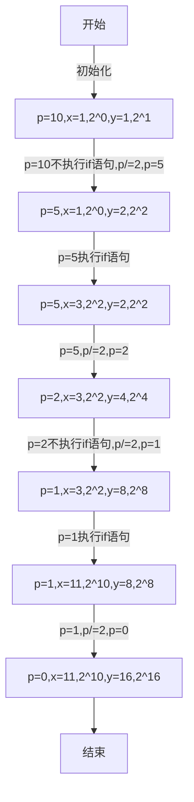

昨天在做一道题的时候，不只是昨天，现在有很多的题，不只是有一个思路就可以解决这个问题，还要考虑到性能的问题，所以现在做题很累，做着做着就想睡觉，这个想法可以解决，但是遇到数目较大的时候就很慢，甚至出错，自己还是需要加油。<!--more-->

昨天做的一道题叫做麦森数，这是求一个2^n-1的问题,要说n小的时候还可以计算，也许口算都可以算出来，但是当n=100，n=500,n=1500,要怎么去计算？这是个很有意思的问题。

# 主角登场

## 题目描述

形如`2^p-1`的素数称为麦森数，这时`p`一定也是素数。但反过来不一定，即如果p是个素数，`2^p-1`不一定也是素数。到1998年底，人们已找到了37个麦森数，最大的一个是`p=3021377`，它有`909526`位。麦森数有许多重要应用，它与完全数密切相关。

任务：从文件中输入`p(1000 < p < 3100000)`，计算2^p-1的位数和最后500位数字(用十进制高精度数表示)

## 输入格式

文件中只包含一个整数`p(1000 < p < 3100000)`

## 输出格式

第一行：十进制高精度数2^p-1的位数。

第2-11行：十进制高精度数2^p-1的最后500位数字。（每行输出50位，共输出10行，不足500位时高位补0）

不必验证2^p-1与p是否为素数。

## 输入输出样例

**输入**

```yaml
1279
```

**输出**

```yaml
386
00000000000000000000000000000000000000000000000000
00000000000000000000000000000000000000000000000000
00000000000000104079321946643990819252403273640855
38615262247266704805319112350403608059673360298012
23944173232418484242161395428100779138356624832346
49081399066056773207629241295093892203457731833496
61583550472959420547689811211693677147548478866962
50138443826029173234888531116082853841658502825560
46662248318909188018470682222031405210266984354887
32958028878050869736186900714720710555703168729087
```

# 思考过程

拿到这个题，我并没有被吓倒，因为以前做过大数相乘的题，当位数太多的时候，可以使用数组来存储这个数的每一位数，然后模拟计算的过程。

首先要考虑的是怎么运算位数，这个我也想了很久，最后也没有用计数的方式实现出来。有这样一个数学公式`n^p=10^q`,其中`n`代表指数函数的底部，`p`代表指数部分，`q`代表十进制的位数-1，其实这个公式也很好理解，当左边的数为个位数时，右边的`q`就是一个小于1的数，当左边的数为三位数时，那么`q`的范围就是`[2,3)`，所以这个`q`只与位数差一，那么可以把等式化简，两边同取以10为底的对数，得到`q=log10(n)*p`,`log`在c++的`<cmath>`库函数中有相应的使用方式，所以位数可以直接使用公式计算出来

再一个就是保存后`500`位，放入一个长度为500的数组中（为了保险点可以将数组开的大一点），高位在后，低位在前。为什么不按照正常的顺序存储，却要反过来，其实这样做是有着极大的好处的。假如说把高位存在前面，那么当位数需要增加时，高位需要往前进一，可是高位已经到头了，前面没有位置可以放了，所以就必须得把其他数都往后移一位，这样当位数较大的时候，是不是很耗费时间与麻烦。把低位放在前面就可以解决这个麻烦了，数组开大一点，进位只需要往后走就可以了，可以扩充的很大。

存储好了，就要想怎么计算了。刚开始我用方法是每次运算的结果只与一个`2`相乘，当`n=1200`的时候，答案还是可以秒出的，但是最大值可是`3100000`，而我数十万的时候，答案就已经出来的很慢了，提交上去，当然会超时。然后看看题解，发现别人用的思想是一个叫做快速幂的东西，百度一下，找了很久才找到一个ppt，发现这个想法是真的好。

快速幂主要用的思想是这样，`2^n=(2^(n-1)^2`，画个图吧。



这个是下面程序运行的一个流程图，对于理解这个思想很重要，`x`数组是存放最后的输出结果，`y`数组是每次都是对于上一次结果一个平方，当`p`等于偶数的时候，肯定最少包含一个偶次方项，等于奇次方项的时候，就要开始合并了，要不然下一次就会超出范围了，反正就是巧得很，最后能算出来结果。

# 代码段

```cpp
#include<iostream>
#include<algorithm>
#include<cmath>
using namespace std;
int x[1000];//保存结果 
int y[1000];//从2开始后一项等于前一项的平方 
int c[1000];//缓存中间结果 
void operation(int x[],int y[])
{
	fill(c,c+1000,0);
	c[0]=x[0]+y[0];//x[0],y[0],c[0],保存数的位数 
	if(c[0]>500){//超过500位的部分就不管了 
		c[0]=500;
	}
	for(int i=0;i<x[0];i++){//两个数模拟乘法运算 
		for(int j=0;j<y[0];j++){
			c[i+j+1]+=x[i+1]*y[j+1];
			if(c[i+j+1]>=10){
				c[i+j+2]+=c[i+j+1]/10;
				c[i+j+1]%=10;
			}
		}
	}
	for(int i=0;i<=c[0];i++){ 
		x[i]=c[i];
	}
}
int main()
{
	int p;
	cin >> p;
	cout << (int)(log10(2)*p+1) << endl;//运用数学公式计算指数函数的位数 
	fill(x,x+1000,0);
	fill(y,y+1000,0);
	x[0]=x[1]=y[0]=1;
	y[1]=2;
	while(p!=0){
		if(p&1!=0){//位运算判断奇偶性 
			operation(x,y);
		}
		p=p>>1;//逻辑除 
		operation(y,y);
	}
	x[1]--;//-1 
	for(int i=500;i>=1;i--){
		cout << x[i] ;
		if((i-1)%50==0){
			cout << endl;
		}
	}
	return 0;
}
```