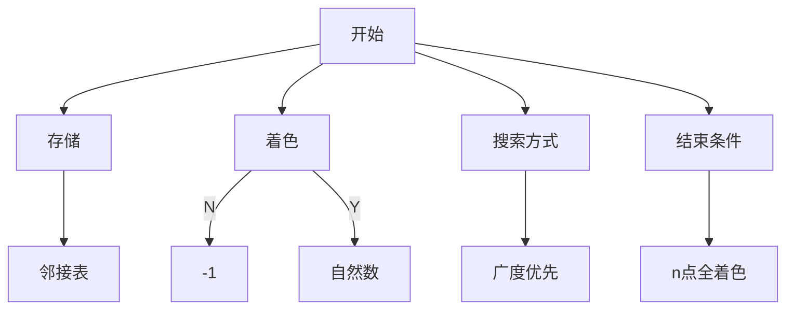
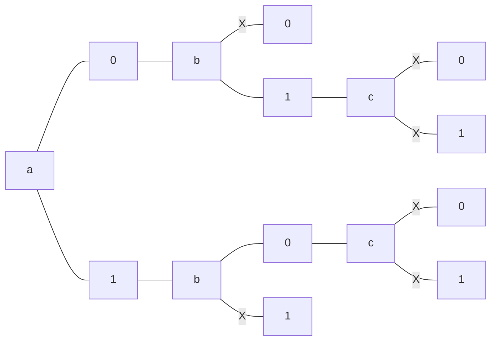

图的着色问题其实就是一个排列问题，用最少的颜色数，使一个图中两两相连的顶点颜色都不相同。<!--more-->

# 着色问题是什么

着色问题又叫做图的着色问题，是最著名的NP-完全问题之一。给定一个无向图G=(V,E)，其中V为顶点集合，E为边集合，图的着色问题即为将V分为K个颜色组，每个组形成一个独立集，即其中没有相邻的集合。(其实就是相邻的顶点颜色都不相同)其优化版本是希望获得最小的K值(最小的颜色种数)。
假设有这样关系的五个顶点，你将如何找出最小的颜色种数。

<svg xmlns="http://www.w3.org/2000/svg" xmlns:xlink="http://www.w3.org/1999/xlink" version="1.1" width="482px" viewBox="-0.5 -0.5 482 421" content="&lt;mxfile host=&quot;www.draw.io&quot; modified=&quot;2020-01-19T09:24:14.402Z&quot; agent=&quot;Mozilla/5.0 (Windows NT 10.0; Win64; x64) AppleWebKit/537.36 (KHTML, like Gecko) Chrome/79.0.3945.117 Safari/537.36&quot; etag=&quot;HPK_xBRoOwD31hks4RHD&quot; version=&quot;12.5.5&quot; type=&quot;device&quot;&gt;&lt;diagram id=&quot;VzxzATcUw6Pp4yFVjl6N&quot; name=&quot;第 1 页&quot;&gt;7Vlbb5swFP41eUwEviTksZekm7ZJlfqwtS+TBS6wAmbGJLBfPxObixMVrQ0pTbWX1ufzsbF9vu/4QCbwKi5uOEmDb8yj0QRYXjGB1xMAlmgh/1ZAqYC5BRTg89BTkN0Cd+EfqkFLo3no0cxwFIxFIkxN0GVJQl1hYIRztjXdHllkPjUlPj0A7lwSHaLfQ08ECnXAosU/0dAP6ifb86XqiUntrHeSBcRj2w4EVxN4xRkTqhUXVzSqzq4+FzVu/UxvszBOE/EvA/wbuPyMvNXTlwf3wcZ0TR7i6VyvTZT1hqkn969NxkXAfJaQaNWil5zliUerWS1ptT5fGUslaEvwFxWi1MEkuWASCkQc6V5ahOJHNXyGtXWvJ6va10XXKDvGLeVhTAXlNZYIXqqJbIRr4H4faCfcWWXXOpzSu6hYI82EJVQh6zCKdL+b881u69U+1NlVB/ZsSDSUsZy7tCcONbUJ96no8UMNcaTgKJNL56Ucx2lERLgx10E09f3Gr2WHbGiCvIAsizHJYnep0hDnP1l6/PCYZHHGzSw6pA1hHHwUZfTwD08ZMCZl9LwbEuX6SRMwj+RyLx+Z3HCXTPPfOas7ptmODhfSwXbSou2ULb/6b9fTyFWpmRR+wNBMcPbU3PPA5Ja8v9PKLy78qtKZPUZs6waEi1kmj1X8rNy3QSjoXUp2sdhKt+YpG8oFLfrjeHjuegC0dA2hi6iFNrdtRYI1FHSKkRobPFDgRIFC5x4oWd4agWpCMFakbPSKNGwkoQFzcpuDB8nJwOmmZPsU6XjADAzPIQPDEwkbn7uwl6auIRhb19bB0Y2l66k1s5ChazA/Rtb4nFSN3qgU3w2VmyJlxyFlYSKyzsy3FdCS1kaOwVob730h2POH1jHuaNHvjhzc5y8ban+tKJqDOkIndSDH18ng999bvcaOIJdxX0PgO+LMwO+xJmM+CFvgmGxBJyqZwLmXTPX10Vwn1tg1E3g/ujY0/RpF94uw78tVB3iJ7gfUNX6jW+CZsmWPl3CBzSnUuvSoPc4NUJLgEyUMeO4JA+19PIGn+3gizfaHNxXY9tdLuPoL&lt;/diagram&gt;&lt;/mxfile&gt;" onclick="(function(svg){var src=window.event.target||window.event.srcElement;while (src!=null&amp;&amp;src.nodeName.toLowerCase()!='a'){src=src.parentNode;}if(src==null){if(svg.wnd!=null&amp;&amp;!svg.wnd.closed){svg.wnd.focus();}else{var r=function(evt){if(evt.data=='ready'&amp;&amp;evt.source==svg.wnd){svg.wnd.postMessage(decodeURIComponent(svg.getAttribute('content')),'*');window.removeEventListener('message',r);}};window.addEventListener('message',r);svg.wnd=window.open('https://www.draw.io/?client=1&amp;lightbox=1&amp;edit=_blank');}}})(this);" style="cursor:pointer;max-width:100%;max-height:421px;"><defs/><g><path d="M 295 20 Q 295 0 257.5 0 Q 220 0 220 28.5 Q 220 57 127.25 57.25" fill="none" stroke="#000000" stroke-miterlimit="10" pointer-events="stroke"/><path d="M 320 45 Q 437 45 437.25 307.25" fill="none" stroke="#000000" stroke-miterlimit="10" pointer-events="stroke"/><path d="M 277.25 62.75 Q 277 135 275 135 Q 273 135 272.75 207.25" fill="none" stroke="#000000" stroke-miterlimit="10" pointer-events="stroke"/><ellipse cx="295" cy="45" rx="25" ry="25" fill="#ffffff" stroke="#000000" stroke-width="2" pointer-events="all"/><g transform="translate(-0.5 -0.5)"><switch><foreignObject style="overflow: visible; text-align: left;" pointer-events="none" width="100%" height="100%" requiredFeatures="http://www.w3.org/TR/SVG11/feature#Extensibility"><div xmlns="http://www.w3.org/1999/xhtml" style="display: flex; align-items: unsafe center; justify-content: unsafe center; width: 48px; height: 1px; padding-top: 45px; margin-left: 272px;"><div style="box-sizing: border-box; font-size: 0; text-align: center; "><div style="display: inline-block; font-size: 12px; font-family: Helvetica; color: #000000; line-height: 1.2; pointer-events: all; white-space: normal; word-wrap: normal; "><font style="font-size: 18px">1</font></div></div></div></foreignObject><text x="295" y="49" fill="#000000" font-family="Helvetica" font-size="12px" text-anchor="middle">1</text></switch></g><ellipse cx="255" cy="225" rx="25" ry="25" fill="#ffffff" stroke="#000000" stroke-width="2" pointer-events="all"/><g transform="translate(-0.5 -0.5)"><switch><foreignObject style="overflow: visible; text-align: left;" pointer-events="none" width="100%" height="100%" requiredFeatures="http://www.w3.org/TR/SVG11/feature#Extensibility"><div xmlns="http://www.w3.org/1999/xhtml" style="display: flex; align-items: unsafe center; justify-content: unsafe center; width: 48px; height: 1px; padding-top: 225px; margin-left: 232px;"><div style="box-sizing: border-box; font-size: 0; text-align: center; "><div style="display: inline-block; font-size: 12px; font-family: Helvetica; color: #000000; line-height: 1.2; pointer-events: all; white-space: normal; word-wrap: normal; "><font style="font-size: 18px">4</font></div></div></div></foreignObject><text x="255" y="229" fill="#000000" font-family="Helvetica" font-size="12px" text-anchor="middle">4</text></switch></g><path d="M 102.75 312.75 Q 244 313 244 250" fill="none" stroke="#000000" stroke-miterlimit="10" pointer-events="stroke"/><ellipse cx="85" cy="295" rx="25" ry="25" fill="#ffffff" stroke="#000000" stroke-width="2" pointer-events="all"/><g transform="translate(-0.5 -0.5)"><switch><foreignObject style="overflow: visible; text-align: left;" pointer-events="none" width="100%" height="100%" requiredFeatures="http://www.w3.org/TR/SVG11/feature#Extensibility"><div xmlns="http://www.w3.org/1999/xhtml" style="display: flex; align-items: unsafe center; justify-content: unsafe center; width: 48px; height: 1px; padding-top: 295px; margin-left: 62px;"><div style="box-sizing: border-box; font-size: 0; text-align: center; "><div style="display: inline-block; font-size: 12px; font-family: Helvetica; color: #000000; line-height: 1.2; pointer-events: all; white-space: normal; word-wrap: normal; "><font style="font-size: 18px">5</font></div></div></div></foreignObject><text x="85" y="299" fill="#000000" font-family="Helvetica" font-size="12px" text-anchor="middle">5</text></switch></g><path d="M 118 63 Q 118 100 59 100 Q 0 100 0 260 Q 0 420 227.5 420 Q 455 420 455 350" fill="none" stroke="#000000" stroke-miterlimit="10" pointer-events="stroke"/><path d="M 162.75 92.75 Q 237 93 237.25 207.25" fill="none" stroke="#000000" stroke-miterlimit="10" pointer-events="stroke"/><path d="M 127.25 92.75 Q 85 93 85 270" fill="none" stroke="#000000" stroke-miterlimit="10" pointer-events="stroke"/><ellipse cx="145" cy="75" rx="25" ry="25" fill="#ffffff" stroke="#000000" stroke-width="2" pointer-events="all"/><g transform="translate(-0.5 -0.5)"><switch><foreignObject style="overflow: visible; text-align: left;" pointer-events="none" width="100%" height="100%" requiredFeatures="http://www.w3.org/TR/SVG11/feature#Extensibility"><div xmlns="http://www.w3.org/1999/xhtml" style="display: flex; align-items: unsafe center; justify-content: unsafe center; width: 48px; height: 1px; padding-top: 75px; margin-left: 122px;"><div style="box-sizing: border-box; font-size: 0; text-align: center; "><div style="display: inline-block; font-size: 12px; font-family: Helvetica; color: #000000; line-height: 1.2; pointer-events: all; white-space: normal; word-wrap: normal; "><font style="font-size: 18px">2</font></div></div></div></foreignObject><text x="145" y="79" fill="#000000" font-family="Helvetica" font-size="12px" text-anchor="middle">2</text></switch></g><path d="M 430 325 Q 273 325 272.75 242.75" fill="none" stroke="#000000" stroke-miterlimit="10" pointer-events="stroke"/><ellipse cx="455" cy="325" rx="25" ry="25" fill="#ffffff" stroke="#000000" stroke-width="2" pointer-events="all"/><g transform="translate(-0.5 -0.5)"><switch><foreignObject style="overflow: visible; text-align: left;" pointer-events="none" width="100%" height="100%" requiredFeatures="http://www.w3.org/TR/SVG11/feature#Extensibility"><div xmlns="http://www.w3.org/1999/xhtml" style="display: flex; align-items: unsafe center; justify-content: unsafe center; width: 48px; height: 1px; padding-top: 325px; margin-left: 432px;"><div style="box-sizing: border-box; font-size: 0; text-align: center; "><div style="display: inline-block; font-size: 12px; font-family: Helvetica; color: #000000; line-height: 1.2; pointer-events: all; white-space: normal; word-wrap: normal; "><font style="font-size: 18px">3</font></div></div></div></foreignObject><text x="455" y="329" fill="#000000" font-family="Helvetica" font-size="12px" text-anchor="middle">3</text></switch></g></g></svg>

# 如何解决这个问题

首先我们需要考虑这样的几个问题,存储，着色，搜索方式，结束条件，我是这样考虑的。



首先我们要考虑的就是如何将这个图存储下来，这里我选择的是邻接表，因为这里存储的是边，只需要判断这条边的两个顶点颜色是否相同，比较方便，还有就是我如何区分已经着色的点和未着色的点，初始化将未着色的点都标记为`-1`，将已经着色的点标记为自然数，每个数都代表一种颜色。

还有就是我采用什么样的策略对各个点都着色，我是这样想的，先把第一个点拿出来，对它标记尝试标记一种颜色，然后判断和它相连的点是否有和它相同的颜色，如果没有就可以把第二点拿出来，尝试填一种颜色，一步步往下走，如果这几种颜色不能使这些点都着不同的颜色，就再加入一种颜色，直到找到最小的颜色数，使这几个点都可以着不同的颜色结束。

下面将演示对于上图五个点只有两种颜色的情况



为了方便观察用abcde表示这五个点，这便是当有两种颜色时的情况，发现是不能使这五个点都着色的。

# 代码实现

```cpp
#include<bits/stdc++.h>
using namespace std;
const int Max=1e6+3;
typedef struct EdgeNode
{
	int to;
};
int flag[Max];//未着色-1,着色自然数
vector<EdgeNode> s[Max];
void build(int n)//初始化
{
	fill(flag,flag+n+2,-1);
}
bool isok(int row)//row顶点是否可以着这种颜色
{
	for(auto it=s[row].begin();it!=s[row].end();it++){
		EdgeNode E=*it;
		if(flag[row]==flag[E.to]){
			return false;
		}
	}
	return true;
}
int t=1;//标记项,只要找到一个着色序列就可以了
void bfs(int row,int n,int m)//给每个顶点着色
{
	if(row==n&&t){
		t--;
		return ;
	}
    for(int i=0;i<m&&t;i++){
        flag[row]=i;
        if(isok(row)){
            bfs(row+1,n,m);
        }
    }
}
int main()
{
	int n,m;//顶点和边的个数
	cin >> n >>m;
	for(int k=0;k<m;k++){//存储图
		int i,j;
		cin >> i >> j;
		EdgeNode e;
		e.to=j-1;
		s[i-1].push_back(e);
		e.to=i-1;
		s[j-1].push_back(e);
	}
	int x=1;//颜色数
	while(t!=0){
        build(n);
		bfs(0,n,x);
		x=t>0?x+1:x;
	}
	cout << x;
	return 0;
}
```
