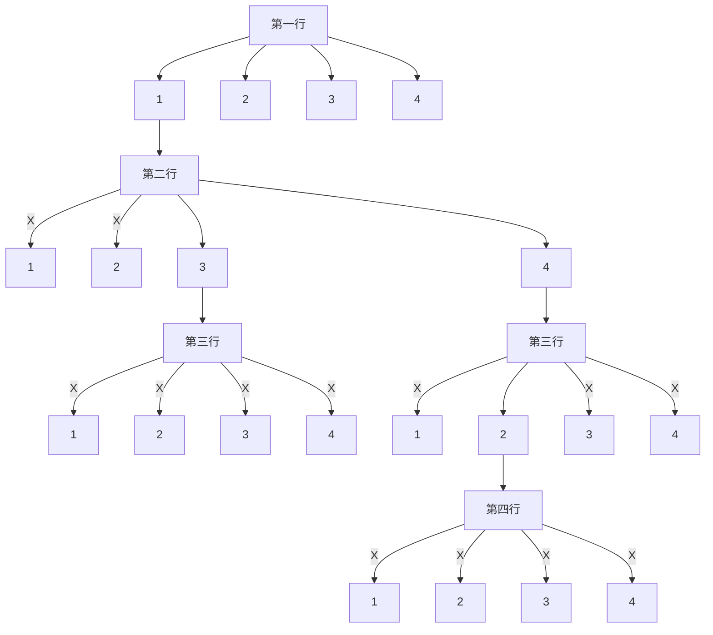
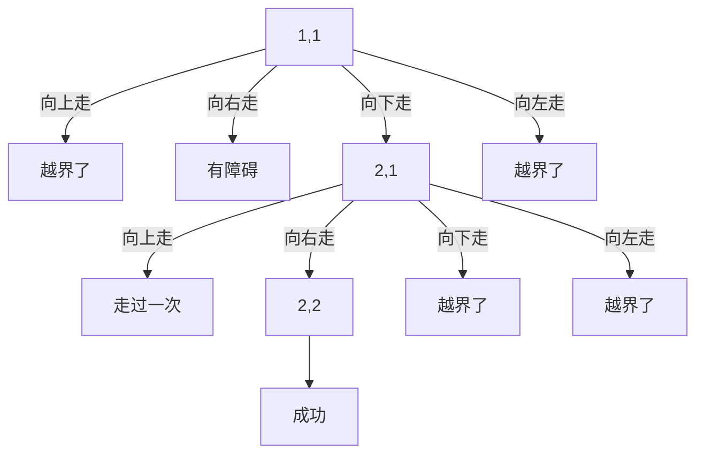

最近在做一些关于深度优先搜索的题，可让我遭了不少的罪，觉得看着啊，没什么难的，网上教学的都说，深度优先搜索实际上就是一个栈，也的确就是这样。但是当我们实际操作过程中，总会遇到一些问题。<!--more-->

最早接触的深度优先搜索是一个二叉树。对一个二叉树来说，就是朝着某一个分支方向不断地向下搜索，走到头之后，往上回一步再走另一个方向。但是要真正的理解，并能熟练地运用和实现他并不是那么容易。

做这样类型的题，首先要选好一个合适的存储方式，方便去遍历它。例如一个图的遍历，如果不太大，选择二维数组会比较好一点，但是也要分析具体的情况，是用带记忆化的搜索还是用不带记忆化的搜索，都需要具体的去分析。

其次就是，要很清楚的掌控在搜索的过程中，每个变量发生的变化，哪些变量在更改后，在回溯的过程中还需要再改回去，哪些自己会改回去，这些变量的变化都要非常的清楚，否则遇到这类题将会比较难受。记得那时候，一个for循环里面嵌套着一个递归式子，这种代码我是看不懂的，那个时候两个递归的式子放到一起运行我也是看不懂的，什么时候运行下一段代码，怎么运行，我完全都搞不懂，怎么办呢，不能就这样放弃啊，最后我就在代码中输出一些变量的变换过程，然后在纸上自己画一画，才搞明白，哦，原来是这么回事啊。

学好dfs的关键就是要理解好八皇后这道题，最后会发现很多问题都可以借助八皇后的这一思想来解决，只需要根据题中的内容添加和修改一些代码就可以了。

下面就根据几道题来看看吧。

1. 有一个N*N的棋盘，有N个棋子要放入在棋盘中，但是这些棋子的摆放是有要求的，棋盘中每行、每列有且只有一个，每条对角线(包括两条主对角线的所有平行线)上至多有一个棋子。问N盘N棋子有几种符合要求的摆放方法？

首先要遇到的问题就是如何存储这个棋盘，棋盘就是一个二维平面图，可以油坐标确定点的位置，所以可以用一个一维数组的下标代表横坐标，该下标所存储的值代表纵坐标，这样就可以优化一下内存。还有就是棋盘中这么多的位置要怎么去填呢？可以一行一行的填，第一行从填在第一列，一直到第N列，找到个符合的位置就继续填第二行，一直填到第N行。

就以4皇后为例



可以从图中看到，当第一行放到第一个位置时，是找不到一个符合的摆放方式的，因此下一步就必须得尝试第一行放在第二列，由于篇幅的原因就不画出来了。从图中也可以看到第一行放到第一个位置，如果这个位置可以放，就可以考虑第二行的棋子该摆放在哪里了，第二行不能放在第一列，也不能放在第二列，但是第三列是可以放的，所以再考虑第三行的棋子该怎么放，结果没有一个棋子可以摆放到符合的位置，所以要返回到第二行，可以尝试放到第二个位置，等等。

代码的主要思想就是这样，下面把核心的代码贴出来

```c++
bool isok(int row)
{
    for(int x=0;x!=row;x++){
        if(c[x]==c[row]||x+c[x]==row+c[row]||x-c[x]==row-c[row]){
            return false;
        }
    }
    return true;
}
void dfs(int n,int row)
{
    if(row==n){
        if(t++<3){
            for(int i=0;i<n;i++){
                cout << c[i]+1 << ' ';
            }
            cout << endl;
        }
        return ;
    }
    else{
        for(int x=0;x!=n;x++){
            c[row]=x;
            if(isok(row)){
                dfs(n,row+1);
            }
        }
    }
}
```

2. 给定一个N*M方格的迷宫，迷宫里有T处障碍，障碍处不可通过。给定起点坐标和终点坐标，问: 每个方格最多经过1次，有多少种从起点坐标到终点坐标的方案。在迷宫中移动有上下左右四种方式，每次只能移动一个方格。数据保证起点上没有障碍。(1<=N,M<=5)

迷宫问题也是个很有意思的问题，在比赛中也有可能会遇得到，首先这个迷宫也和八皇后的棋盘一样都是一个二维平面图，所以也可以用二维数组来表示，题目中所给的有这样几条要解决的信息

①障碍处不可通过，遇到障碍点是不可以通过的。
②每个方格只可以经过一次，也就是前一步经过了这个方格，下一步遇到这个方格就变成障碍了。
③有上下左右四种移动方式。

首要要考虑的就是存储了，这里我用的是一个二维数组来表示的，因为N和M的最大值也就是5，其次就是比较好实现上下左右的移动，只需要对下标值进行变动就可以了，还有就是可以很好的判断这个点是不是障碍点，不是障碍点我可以设置为0，是障碍点我可以设置为1，以及当我走过这一个障碍点的时候，就可以将它设置为1。四个方向，只需要一个二维数组保存四个方向的坐标要改变多少，向上走(-1,0),向下走(1,0),向左走(0,-1),向右走(0,1)。
但是还要主意好边界的问题，不能够越界，下面以此例子画一个图

输入格式
第一行N、M和T，N为行，M为列，T为障碍总数。第二行起点坐标SX,SY，终点坐标FX,FY。接下来T行，每行为障碍点的坐标。

输出格式
给定起点坐标和终点坐标，问每个方格最多经过1次，从起点坐标到终点坐标的方案总数。

输入样例
2 2 1
1 1 2 2
1 2

输出样例
1



结果大家可以看到只有一种方案可以成功走到终点，从起点开始，每个点都有四个方向可以走，任何一个方向都可以去尝试，如果成功了就可以往下走，直到走到终点或者结束走不下去，另外还要注意一点，就是一点只能走一次的问题，当走过这个点就要改变这一点的状态，例如没有走过的点设为0，那么走过之后就要改变为1，然后，当从这个点往下要走的点全部走完之后，还要把这一点的状态改变回来，不能迷宫的原始状态。
上面三个问题其实我已经说过了，怎么解决，下面把核心代码贴在下面

```mermaid
int s[10][10];
int dir[][2]={{1,0},{-1,0},{0,1},{0,-1}};
int sum=0;
void dfs(int m,int n)
{
    if(m==fx&&n==fy){
        sum++;
        return ;
    }
    for(int i=0;i<4;i++){
        if(!s[m+dir[i][0]][n+dir[i][1]]){
            if(m+dir[i][0]>0&&n+dir[i][1]>0){
                if(m+dir[i][0]<=N&&n+dir[i][1]<=M){
                    s[m+dir[i][0]][n+dir[i][1]]=1;
                    dfs(m+dir[i][0],n+dir[i][1]);
                    s[m+dir[i][0]][n+dir[i][1]]=0;
                }
            }
        }
    }
}
```
