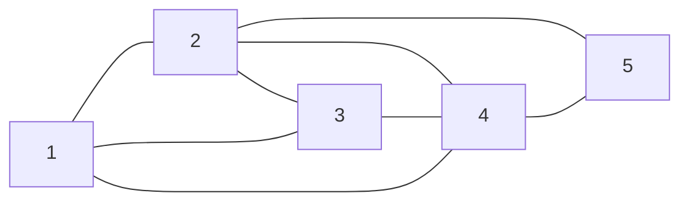
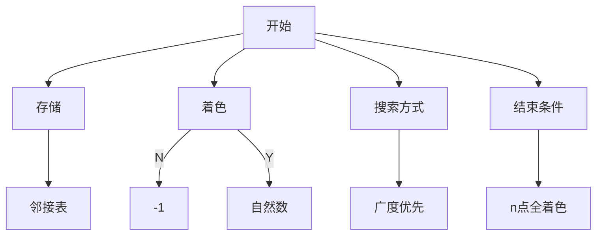
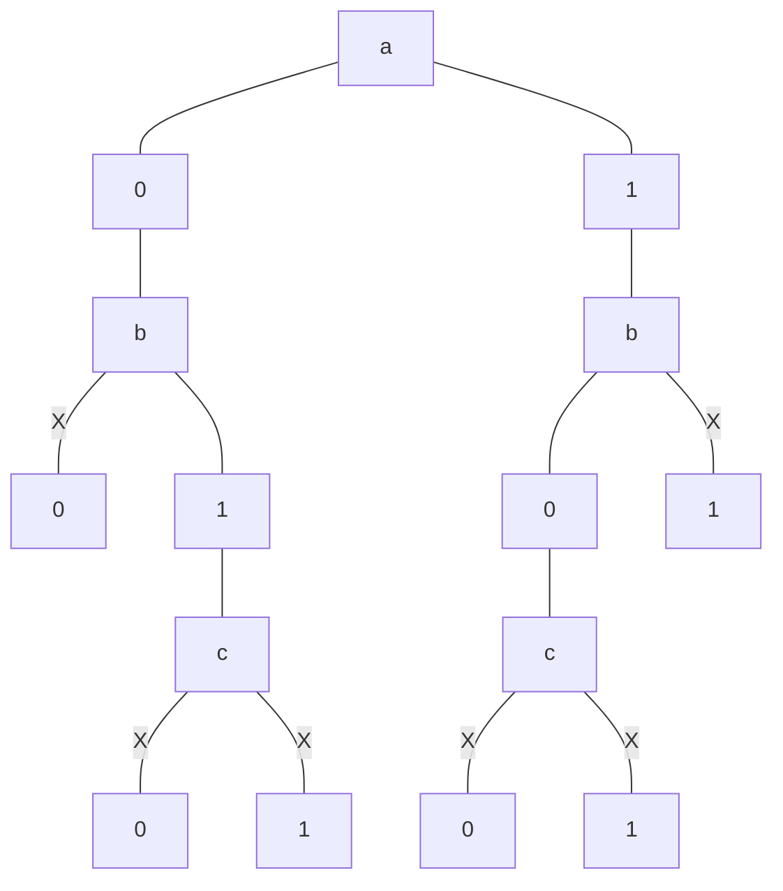

图的着色问题其实就是一个排列问题，用最少的颜色数，使一个图中两两相连的顶点颜色都不相同。<!--more-->

# 着色问题是什么

着色问题又叫做图的着色问题，是最著名的NP-完全问题之一。给定一个无向图G=(V,E)，其中V为顶点集合，E为边集合，图的着色问题即为将V分为K个颜色组，每个组形成一个独立集，即其中没有相邻的集合。(其实就是相邻的顶点颜色都不相同)其优化版本是希望获得最小的K值(最小的颜色种数)。
假设有这样关系的五个顶点，你将如何找出最小的颜色种数。



# 如何解决这个问题

首先我们需要考虑这样的几个问题,存储，着色，搜索方式，结束条件，我是这样考虑的。



首先我们要考虑的就是如何将这个图存储下来，这里我选择的是邻接表，因为这里存储的是边，只需要判断这条边的两个顶点颜色是否相同，比较方便，还有就是我如何区分已经着色的点和未着色的点，初始化将未着色的点都标记为`-1`，将已经着色的点标记为自然数，每个数都代表一种颜色。

还有就是我采用什么样的策略对各个点都着色，我是这样想的，先把第一个点拿出来，对它标记尝试标记一种颜色，然后判断和它相连的点是否有和它相同的颜色，如果没有就可以把第二点拿出来，尝试填一种颜色，一步步往下走，如果这几种颜色不能使这些点都着不同的颜色，就再加入一种颜色，直到找到最小的颜色数，使这几个点都可以着不同的颜色结束。

下面将演示对于上图五个点只有两种颜色的情况



为了方便观察用abcde表示这五个点，这便是当有两种颜色时的情况，发现是不能使这五个点都着色的。

# 代码实现

```c++
#include<bits/stdc++.h>
using namespace std;
const int Max=1e6+3;
typedef struct EdgeNode
{
	int to;
};
int flag[Max];//未着色-1,着色自然数
vector<EdgeNode> s[Max];
void build(int n)//初始化
{
	fill(flag,flag+n+2,-1);
}
bool isok(int row)//row顶点是否可以着这种颜色
{
	for(auto it=s[row].begin();it!=s[row].end();it++){
		EdgeNode E=*it;
		if(flag[row]==flag[E.to]){
			return false;
		}
	}
	return true;
}
int t=1;//标记项,只要找到一个着色序列就可以了
void bfs(int row,int n,int m)//给每个顶点着色
{
	if(row==n&&t){
		t--;
		return ;
	}
    for(int i=0;i<m&&t;i++){
        flag[row]=i;
        if(isok(row)){
            bfs(row+1,n,m);
        }
    }
}
int main()
{
	int n,m;//顶点和边的个数
	cin >> n >>m;
	for(int k=0;k<m;k++){//存储图
		int i,j;
		cin >> i >> j;
		EdgeNode e;
		e.to=j-1;
		s[i-1].push_back(e);
		e.to=i-1;
		s[j-1].push_back(e);
	}
	int x=1;//颜色数
	while(t!=0){
        build(n);
		bfs(0,n,x);
		x=t>0?x+1:x;
	}
	cout << x;
	return 0;
}
```
