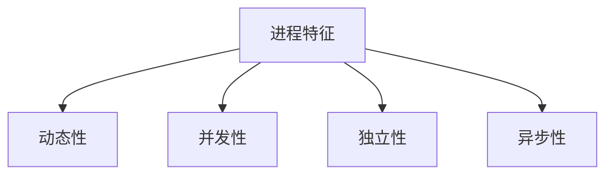
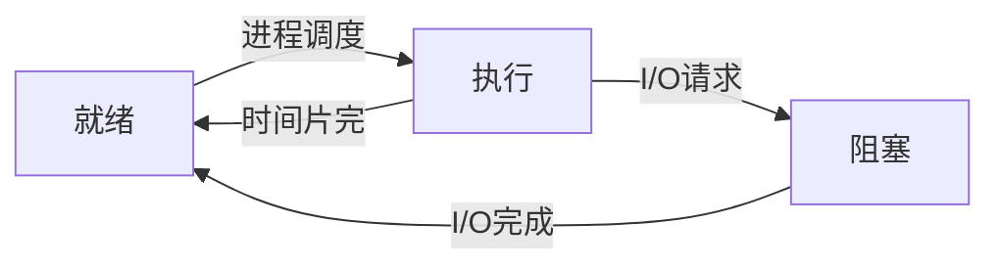
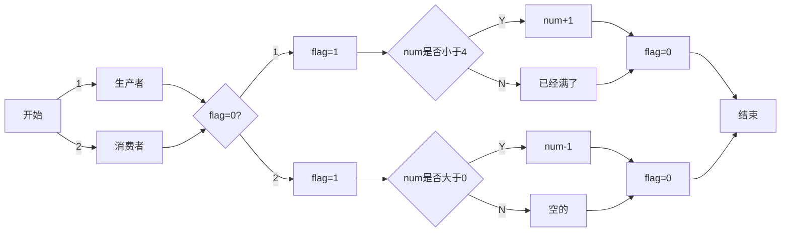

社会发展到今天，电子产品一天也离不开我们的生活。通常程序(APP)是不可以并发运行的，如果并发运行将会因为程序执行速度的不同，结果就不可控制了，但是日常生活中我们常需要程序一起运行，例如我想听歌，还想查看网页，进程概念由此而生。<!--more-->

# 什么是进程

进程的定义，站在不同的角度就会有不同的定义，较为经典的有以下几种。
1. 进程是程序的一次执行。
2. 进程是一个程序及其数据在处理机上顺序执行时所发生的活动。
3. 进程是具有独立功能的程序在一个数据集合上运行的过程，它是系统进行资源分配和调度的一个基本单位。

在引入了`进程实体`概念之后，传统OS中的定义为：**进程是进程实体的运行过程，是系统进行资源分配和调度的一个独立单位**。

## 什么进程实体？

由程序段，相关数据段和PCB(进程控制块)组成。

# 进程的特征



# 进程的三种基本状态



假如说是五种状态，就在加入挂起和激活状态就可以了，其实也还是根据上边这个图来的。

# 为什么要引入生产者与消费者关系

举一个例子吧。

```c++
int a = 2,b = 3;
① a = a + b;
② b = a * b;
```

把①和②当做两个进程，当他们两个顺序执行时可以得到的结果是`a=5`,`b=15`，这个才是正常的。
但是当两者随着运算顺序的不同，得到的结果也相异，有以下三种情况

+ 进程①比进程②运算的快的时候 `a=5`,`b=15`
+ 当进程①跟进程②同时运行的时候 `a=5`,`b=6`
+ 当进程①比进程②运算慢的时候 `a=8`,`b=6`

这还只是两个进程，有三种结果，当程序多的时候，结果的基数也会变得很大，但是我们要的只是正确的那一个，所以我们要防止这种情况出现，生产者与消费者关系就可以很好的解决这样的情况。

# 生产者与消费者关系

生产者和消费者中间还有一个缓冲区，生产者生产完的东西就放在缓冲区里，消费者获取东西也要从缓冲区里面取。但是它们之间必须要有这样的约定，不允许生产者向一个一个已经装满了商品且尚未取走的缓冲池投放产品，不允许消费者从一个空的缓冲池取产品。

```mermaid
graph LR
 subgraph 
   c[消费者]
end
 subgraph 缓冲池
   b1[空]
   b2[满]
   b3[满]
   b4[空]
end
 subgraph 
  a[生产者]
end
a -- 4 --> b4
a -- 1 --> b1
b2 -- 2 --> c
b3 -- 3 --> c
```

生产者可以选择1或4把生产的产品放进去，消费者可以选择2或3买走商品。

# 程序代码实现

```c++
while(true){
    进入区;
    临界区;
    退出去;
    剩余区;
}
```

实现原理，当生产者要生产东西的时候，需要判断是否有消费者正在买东西，如果没有消费者就在找找在缓冲池中还有空的缓冲区不，有就放进去，没有就结束。当消费者要买东西时，需要判断是否有生产者正在生产东西，如果没有进去找一个不是空的买，然后结束。思路流程图如下。

```c++
int n;//代表缓冲区的数量
int num=n;//代表缓冲池还剩几个空缓冲区
int flag=0;//标记当前临界区即缓冲池是否有人访问
```



**代码**

```c++
#include<bits/stdc++.h>
using namespace std;
int main()
{
    int m;//代表有几个满缓冲池
    int n;//代表缓冲区的数量
    int flag;//标记当前临界区即缓冲池是否有人访问,0是没人,1是有人
    int key;//输入1和2，代表生产者或者消费者
    cin >> n >> m >> key >> flag;
    int num=m;//代表缓冲池有几个慢缓冲区
    if(key==1){
        if(!flag){
            flag=1;
            if(num<n){
                cout << "生产者找到个空缓冲池放进去";
                num+=1;
            }
            else{
                cout << "已经满了";
            }
            flag=0;
        }
    }
    else{
        if(!flag){
            flag=1;
            if(num>0){
                cout << "消费者找到了个满缓冲区买走";
                num-=1;
            }
            else{
                cout << "空的";
            }
            flag=0;
        }
    }
    if(flag){
        cout << "被占用";
    }
    return 0;
}
```